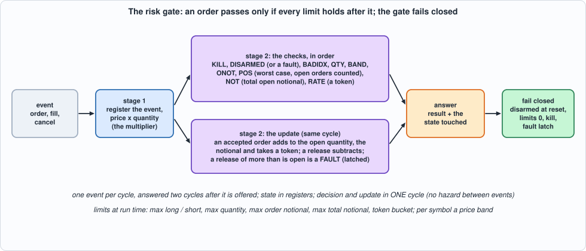
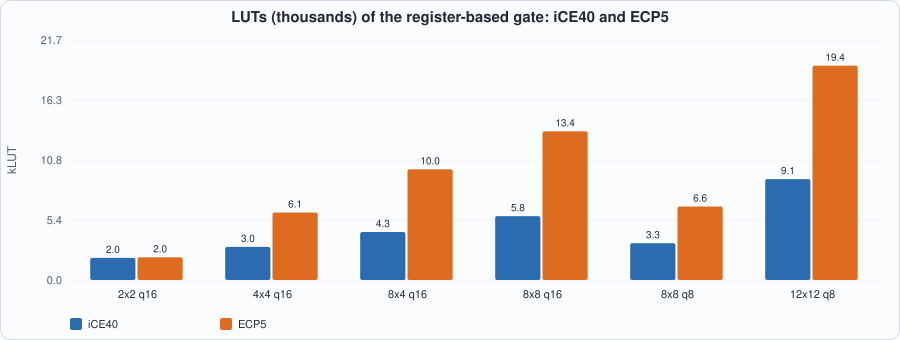
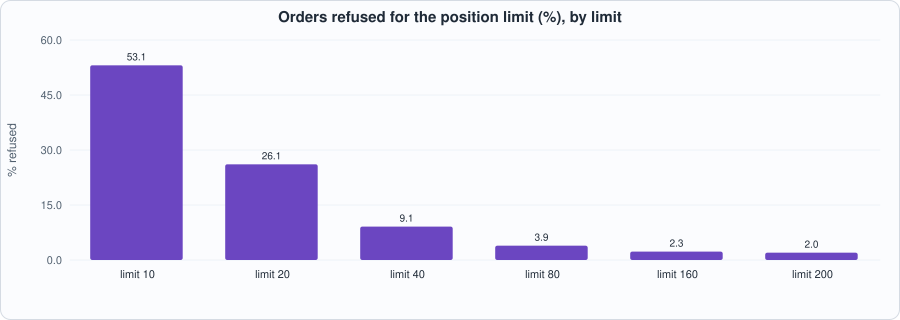
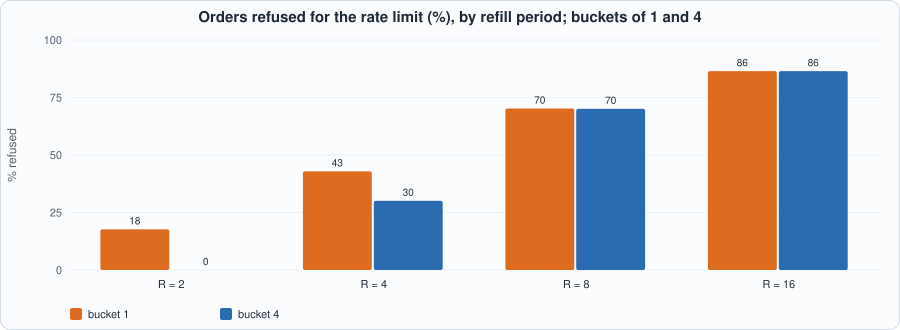

# 23. Pre-Trade Risk: Position, Notional and Rate Limits, a Price Band, a Kill Switch, a Gate That Fails Closed, and a Bounded Proof That It Holds


--8<-- "docs/assets/art/ch-23.md"


**What you will see:** every order the system sends passes through one place that can say no. A **risk gate** keeps, for each account and symbol, what the account holds and what it has in flight, and refuses an order that would take it past a limit, counting the worst case in which **everything still open is executed**. It also refuses orders too large, too far from the market, too many in a short time, or sent while a **kill switch** is on, and it **fails closed**: after a reset, after a malformed report from the order manager, and whenever it is not sure, it says no. The chapter writes the specification first, builds a gate that decides and updates its state in **one cycle**, tests it **cycle for cycle** against the specification and, because this is the one place where a bug costs money and the test of "it passed 10,000 random orders" is not enough, **proves in the SAT engine** that, for every possible sequence of up to 6 cycles from reset, an order the gate approves leaves every limit intact.

**What you need to know first:** Chapter 5 (the DSP multiplier), Chapter 6 (a verification harness and Yosys's SAT engine), Chapter 20 (a state machine tested against a model in which time is part of the specification) and Chapter 22 (fixed-point arithmetic and its widths).

**What this chapter builds:** `rtl/risk.sv` (`risk` and the pin wrapper `risk_syn`), `model/risk_gold.py` (the specification, the closed loop and the stimulus), `tb/risk_tb.sv`, `formal/risk_props.sv` (the properties), `tools/ch23_run.py`, `tools/ch23_formal.py`, `tools/ch23_example_a.py`, `tools/ch23_example_b.py`, `tools/mut_ch23.py`, `tools/make_figs_ch23.py`.

!!! note "Scope: what this chapter leaves out, on purpose"
    **The gate protects against what is known to it**: the orders it approved and the releases the order manager reports. It does not see the exchange; an order already sent is not recalled by the kill switch (the kill acts on the next order). **A release names the order's side, price and the quantity released**; a release that does not match what is open is a **fault**, and the gate latches it (a real order manager keeps a table of live orders; here the gate checks the totals). **State is in registers** (a few accounts and symbols: `NA, NS <= 15`); a RAM-based gate, which has a read-modify-write hazard between consecutive events on the same account, is an exercise. **The proof is bounded**: for every input sequence of up to **6 cycles** from reset, not for all time (see "The proof"). **Contract**: the limits `max_long` and `max_short` are below 2^(QW-1) and `max_not` below 2^(PW+QW+1) (so that no register overflows), `in_valid` is 0 while the reset is applied, and the event type is 0 to 2. **No design here comes near 125 MHz** (Example A). This is a model of a design, not a product.

## What the gate promises

`model/risk_gold.py` states it in plain Python. Per account `a` and symbol `s` the gate keeps `pos` (net shares filled), `ob` and `os` (shares **open**: accepted, not yet filled or cancelled, on the buy and sell side); per account the **notional** (the sum of price x quantity of the open orders) and a **token bucket**. An **ORDER** is checked in a fixed order and the first failure is the answer:

| code | result | refused because |
|---|---|---|
| 1 | KILL | the kill input was high in the cycle the order was offered |
| 2 | DISARMED | the gate is not armed, or a fault has happened |
| 3 | BADIDX | the account or the symbol does not exist |
| 4 | QTY | the quantity is 0 or above `max_qty` |
| 5 | BAND | the price is outside the symbol's band `lo..hi` (inclusive) |
| 6 | ONOT | price x quantity is above `max_onot` |
| 7 | POS | a buy: `pos + ob + qty > max_long`; a sell: `pos - os - qty < -max_short` |
| 8 | NOT | the open notional plus this order's is above `max_not` |
| 9 | RATE | the account's bucket has no token |
| 0 | OK | none of the above: the order is added to `ob` or `os` and to the notional and takes a token |

**The worst case is the point of POS and NOT.** `pos + ob` is the largest long position the account can reach if every open buy is filled and nothing else happens; a limit on `pos` alone would let an account that has 100 shares of buys open in the market buy 100 more. A **fill** moves `pos` and releases `ob` or `os` (so `pos + ob` is unchanged by a fill); a **cancel** releases without moving `pos`; both release the notional of the part released. They are applied **even when the gate is disarmed or killed**: a cancel must always get through. A release of more than is open, or for an account or symbol that does not exist, changes nothing, answers **FAULT** and **latches** the fault: from then on every order is refused until reset (the books of the gate and of the order manager no longer agree, and the gate cannot tell which is right).

**Fails closed.** After reset the gate is disarmed, the fault latch is clear, every limit register that matters is 0 (`max_qty = 0` refuses every order even if somebody arms the gate before configuring it) and every band is empty. `arm` (a pulse) is refused while `kill` is high; `disarm` wins over `arm`; `kill` is a level, sampled in the cycle the order is offered. Tokens come back one per `R` cycles up to the bucket's size; writing an account's configuration refills its bucket.

**Time.** One event per cycle, answered two cycles after it is offered, with no stall. A write (a configuration, a band, `arm`, `disarm`) in cycle `c` is seen by the orders offered from cycle `c` on (they are checked in cycle `a + 1 > c`).

```python
--8<-- "model/risk_gold.py"
```

The hand-checked scenarios are worked out on paper: every result at the exact boundary of its limit (a quantity of exactly `max_qty`, a price on each end of the band, a notional of exactly `max_onot` and `max_not`, a short position of exactly `-max_short`), the order of the checks, a release that is a fault and the refusal after it, and the cycle-level timing of a write against an order, of `arm` against `kill` and of the token tick (an answer shows the tokens *before* the tick of its own cycle).

## The hardware


*Figure 23.1: the risk gate.*

- **Stage 1** registers the event, **samples the kill input with it**, and forms `price x quantity` (a 16 x 16-bit multiplication: a DSP block where there is one).
- **Stage 2 checks and updates in the same cycle**: it reads the touched account and symbol from the register arrays, applies the checks in the order of the table, and writes back the new open quantity, notional, position and tokens. One event completes per cycle, so a second event on the same account sees the state the first one left: **there is no hazard to forward**. The price is the clock (Example A).
- **The token bucket** takes a token in the same cycle as the order and refills on a global tick; the same register update does both (`min(cap, tokens - taken + tick)`), and a configuration write wins.
- **What resets**: `armed`, `fault`, the tick counter, `max_qty`, the bucket sizes, the tokens, positions, open quantities and notionals, and the bands (empty). The other limits are **not** reset: with `max_qty = 0` no order gets past the quantity check, so they cannot matter (the mutation run found that resetting them was code that could not matter).
- **The answer** is the result and the state of the touched account and symbol after the update (zeros for a bad index): the testbench checks the state, not only the verdict.

```systemverilog
--8<-- "rtl/risk.sv"
```

## The tests

```systemverilog
--8<-- "tb/risk_tb.sv"
```

```python
--8<-- "tools/ch23_run.py"
```

To run: `python3 tools/ch23_run.py` (a few minutes). Recorded output:

```text
--8<-- "out/ch23_run_out.txt"
```

**Reading the output.**

- **Section 3: the gate equals the model in all 30 rows** (5 sizes, 6 kinds of traffic), in Icarus (every register of the gate powered up with **garbage that would let orders through**: armed, fault clear or set, a non-zero tick phase, limits of 7, positions, tokens) and in Verilator. Every answer (kind, result, position, open buys and sells, notional, tokens) is compared in the cycle the model says.
- **The stimulus is checked too (section 2).** The first version of the random generator offered releases for every order it had *offered*, accepted or not, so nearly every run ended in a FAULT after a few cycles and **only 0 or 1 order in 390 was accepted**: the gate was being tested on its refusals. The generator now runs a copy of the gate alongside, so that releases name orders that were accepted; every result code appears in section 2 (FAULT only in the kinds that make one).
- The six kinds: *random* (limits at random, fills, cancels, bad indexes, kill and arm pulses); *tight* (small limits, so that the boundaries are hit often); *dense* (a message every cycle, with kills, bad indexes and a rare malformed release); *edge* (the directed boundary sequence: every result once, each limit at its boundary); *reset* (the first cycles after reset: an order to an account nobody configured, and a stream of accepted orders that empties and refills a bucket, which shows the phase of the token tick); *fault* (five runs, each from reset, with one kind of impossible release: one more than is open on the sell side, the exact open quantity and then one more, a notional exactly one more than is open, a bad account, a bad symbol).

## The proof

Tests show that the gate agrees with a model on the cases somebody thought of. A **bounded proof** shows that, **for every input sequence of up to N cycles from reset**, a set of properties holds. `formal/risk_props.sv` wraps the gate and drives it with **free** inputs (any event, any configuration, any control, any kill, in every cycle). It also keeps its **own account** of what the specification says, in a different form from the gate's: instead of an open quantity and a position it keeps **cumulative sums** (shares accepted, filled and cancelled, per side; notional accepted and released), from which the open quantity is `accepted - filled - cancelled`, the position is `bought - sold`, and the worst-case long exposure is `accepted buys - cancelled buys - filled sells`. From the sums it computes what the answer must be, and asserts, for every event:

- **S1, the safety property**, stated on what the gate *said*: **if the gate answers OK to an order, then** the gate was armed, not faulted and not killed; the account and symbol exist; the quantity is within its limit; the price is within the band; the order's notional is within its limit; **after the order, the worst-case long (or short) exposure is within its limit and the total open notional is within its limit**; and a token was available;
- **S2** the answer equals the one computed from the sums; **S3** the state shown (position, open buys and sells, notional, tokens) equals the sums; **S4** the bucket never holds more than its size.

S1 is the sentence a risk officer cares about; S2 and S3 say the gate computes what it should (so S1 is not true of some other machine). The proof engine is Yosys's `sat -prove-asserts -set-assumes -set-init-zero -seq N`: the gate and the wrapper are unrolled for `N` cycles from reset and the engine looks for a cycle in which an assertion fails.

```systemverilog
--8<-- "formal/risk_props.sv"
```

```python
--8<-- "tools/ch23_formal.py"
```

To run: `DEPTH=6 python3 tools/ch23_formal.py` (about a quarter of an hour). Recorded output:

```text
--8<-- "out/ch23_formal_out.txt"
```

- **The correct gate is proved for 6 cycles from reset** (478 s on 4 cores shared with other jobs). **That is a bounded proof**: six cycles cover a configuration, an arming, up to about three events and their answers; it says nothing about cycle 7. It does cover **every** such sequence, including ones nobody would think to write. **Depths 7 and 8 did not finish in 3,000 seconds each** (section 3 of the output: the engine's time grows steeply with the depth); an unbounded proof (an induction with an invariant that implies S1) is Exercise 4.
- **Every one of 15 mutants of the gate that matter for safety is refused by the same search** within 12 to 28 seconds each, at depth 6: the long and short checks without the open orders or the position, the notional without the open orders, each of the band, quantity, order-notional and notional checks removed, the kill input ignored, a fault or a disarmed gate letting orders through, an order that does not take a token or does not add to the open buys, a fill that does not move the position, a bucket that can exceed its size, and a `>=` for a `>`. The simulation battery catches the same mutants; the proof shows that **no sequence of six cycles** slips past them, and that the properties are not vacuous.
- **Two things went wrong in the proof, in ways worth knowing.** (1) The first run said the correct gate **fails** at depth 8: Yosys's `sat -prove-asserts` **ignores `assume` unless `-set-assumes` is given** (checked on a four-line example), so the contract was not being enforced and the "counterexamples" were configurations outside the contract. (2) With the assumptions on, a depth-6 counterexample remained: an **event offered while the reset is applied**. The RTL no longer gated the first stage with the reset (the mutation run had shown that gating redundant, given that `in_valid` is 0 during reset), so the contract needed one more line, `assume (!rst || !ev_valid)`: the proof found a place where the contract mattered, not a bug in the gate.

## Running example A: what it costs and how fast it runs

```python
--8<-- "tools/ch23_example_a.py"
```

To run: `python3 tools/ch23_example_a.py` (about twenty minutes). Recorded output:

```text
--8<-- "out/ch23_example_a_out.txt"
```


*Figure 23.2: LUTs of the register-based gate.*

- **Measured:** the gate is **big and slow**. Two accounts and two symbols (286 bits of state) are **1,997 LUTs at 38.4 MHz** on iCE40 and 2,050 LUTs, 39.3 MHz on ECP5; four and four (970 bits) are 2,992 LUTs at **28.4 MHz** and 6,098 LUTs at 35.6 MHz; **eight accounts and four symbols do not fit the iCE40** (4,336 LUTs and 3,401 flip-flops, and the place-and-route fails), eight and eight are 13,440 LUTs and 30.3 MHz on ECP5, and **twelve and twelve do not fit even the ECP5** (47,192 LUTs for 24,000). Narrowing the quantity and price to 8 bits each cuts 8 x 8 from 13,440 to 6,639 LUTs on ECP5 and brings it to 28.8 MHz on iCE40.
- **The clock is limited by routing**, not by logic: the critical path is the stage-2 index (`s1_a` or `s1_s`) through the register arrays and back to the token or open-quantity registers, **10.9 ns of logic and 24.3 ns of routing** on iCE40 at 4 x 4 (ECP5: 9.0 and 19.1; at 8 x 8, 8.2 and 24.7): the index fans out to every account's and symbol's registers, which is the price of reading, checking and updating the state in one cycle. **Nowhere near 125 MHz.** Pipelining the state read (Exercise 1) is the fix, and it costs the forwarding the single-cycle design avoids.
- **The DSP block barely matters here.** The multiplier (price x quantity) is 16 x 16 bits and costs 678 LUTs at 2 x 2 (2,728 without the DSP, 2,050 with) and the clock is the same (41.7 against 39.3 MHz without it: the DSP is not on the critical path): the cost of this gate is its **state**, not its arithmetic. Compare Chapter 22, where the multiplication was the path.
- **What it means:** at a few accounts and symbols the gate is a design that fits and decides in 2 cycles (2 cycles are **57 ns at 35 MHz**; at 125 MHz the same two cycles would be 16 ns: here the clock, not the cycle count, is the problem); with more it needs RAM and a different structure (Exercise 2).

## Running example B: what the limits do to a stream of orders

```python
--8<-- "tools/ch23_example_b.py"
```

To run: `python3 tools/ch23_example_b.py`. Recorded output:

```text
--8<-- "out/ch23_example_b_out.txt"
```


*Figure 23.3: orders refused for the position limit.*


*Figure 23.4: orders refused for the rate limit.*

- **The position limit is reached and never exceeded.** On 200,000 cycles of a stream that fills and cancels at random, the largest position and the largest worst-case exposure equal the limit at every limit from 10 to 200 and **never go above it**. The price is orders refused: **53% at a limit of 10, 26% at 20, 9% at 40, 3.9% at 80, 2.3% at 160 and 2.0% at 200**; a limit of 40 or less is a trading constraint on this stream and one of 160 or more is a guard rail. Counting open orders in the exposure is what makes the limit hold; it is also why a small limit refuses so much.
- **The rate limit is a ceiling on accepted orders, not a smoother.** With one token every 2 cycles a bucket of 1 refuses 18% of the orders and a bucket of 4 none; with one token every 8 cycles **70% of the orders are refused whatever the bucket** (the stream averages 0.3 orders per cycle and the limit is 0.125): a bucket only absorbs a burst, the refill period sets the sustained rate.
- **The kill switch is exact, and a pipeline is not instantaneous.** With kill raised for 50 cycles at about 0.2% of the cycles (392 times in 200,000), **no order offered while it was up was accepted** (as the specification says), 9,022 were refused for KILL, and **123 orders offered in the cycle just before a kill rose were accepted**: they were already in the pipeline. That is the gate's whole exposure to the kill: one cycle of orders, plus everything already sent to the exchange.

## Testing the tests

Two families of mutants: the **RTL** (81 mutants; battery: the gate against the cycle model, on five sizes and six kinds of traffic) and the **model** (16 mutants; battery: the hand-checked scenarios).

```python
--8<-- "tools/mut_ch23.py"
```

To run: `python3 tools/mut_ch23.py` (a few minutes). Recorded output:

```text
--8<-- "out/ch23_mut_out.txt"
```

**Result: 97 of 97 caught**, after a first run that caught 89 of 99. It was a long road, and the road is the lesson:

| survivor | why | what was done |
|---|---|---|
| the long check ignores the position | **a missing test**: no case had a position and an order that fails only because of it | directed: an order after a fill |
| a release is not applied while disarmed | **a missing test** | directed: a cancel while disarmed and killed |
| `arm` ignores the kill input; `arm` wins over `disarm` | **missing tests**: no case with both in one cycle | directed |
| `arm` ignores a fault | **equivalent**: a fault refuses every order whether or not the gate is armed | the condition removed from the RTL, the model and the wrapper |
| reset arms the gate | **a missing test**: every test armed the gate first | directed: an order before the first `arm` |
| reset does not clear the fault, or the tick phase | **a weak test**: the powered-up garbage had the fault clear and the phase 0 | the garbage now sets the fault and a phase that is wrong; a *reset* kind added for the phase |
| reset does not clear the order-notional limit | **equivalent**: `max_qty = 0` refuses first | the resets of the limits that cannot matter removed; the reset of the bucket size kept, with a directed test |
| the answer is valid while the gate is in reset | **equivalent** under the contract (no event during reset) | the gating removed; the contract made explicit and assumed in the proof |
| a release of more than is open is accepted (sell side); a release of one more notional than is open | **missing tests**, found only after the generator was fixed (above) and then needed one run per kind of fault, since a fault latches until reset | the *fault* kind: five runs from reset |

## What this chapter established, and what it did not

**Established, with the tests that show it:** a risk gate whose answers **equal a specification in every cycle**, the state it shows included, on five sizes and six kinds of traffic in two simulators; a **bounded proof** (6 cycles from reset, every input sequence, under a stated contract) of the property that matters, S1, with the answers (S2), the state (S3) and the bucket (S4); fifteen safety mutants each refused by the proof; **the cost of a decision and update in one cycle in registers** (Example A); **what the limits cost in refused orders** and an **exact kill switch**; 97 of 97 mutants caught.

**Not established:** an **unbounded** proof (the bound is six cycles; seven and eight did not finish in 50 minutes each on this machine: Exercise 4); a clock above 40 MHz (**Example A: this design is slow**; Exercise 1); a RAM-based gate, which for many accounts is the only kind that fits; an order manager's table of live orders (here the gate checks totals, and a release that does not match is a fault); protection of orders already sent; that the *limits themselves* are right (a gate that enforces the wrong limit perfectly is a perfectly safe gate against the wrong risk).

## Self-check questions

1. Why does the position check count the open orders (`pos + ob + qty`) instead of the position alone?
2. In which order are the checks made, and why is KILL first and RATE last? What does a rejected order change?
3. Why are fills and cancels applied while the gate is disarmed or killed? What is a FAULT, and why is it latched?
4. What does "fails closed" mean for the reset values here? Why is it enough to reset `max_qty`?
5. A configuration write in cycle `c` and an order offered in cycle `c`: does the order see the new limits? And an `arm` in cycle `c` against an order offered in cycle `c - 1`?
6. Why does an answer show the tokens before the tick of its own cycle?
7. Why can the gate decide and update in one cycle without a hazard, and what does it cost?
8. State S1. Why is it stated on the gate's answer and the wrapper's cumulative sums instead of the gate's own registers?
9. What does "proved for 6 cycles" mean, and what does it not mean? Why do 15 mutants being found by the proof matter?
10. Why did the first proof run fail on a correct gate, and what was the second counterexample?
11. What does the kill switch not stop?
12. Name two survivors of the first mutation run and say, for each, whether it was equivalent or a missing test, and what was done.

## Exercises

1. **Pipeline the state read.** Read the account's state in one stage and check in the next, with forwarding of the previous event's update when it touched the same account. What is the latency, the hazard, and the clock on ECP5 at 8 accounts and 8 symbols?
2. **A RAM-based gate.** Put the position, open quantities and notional in block RAM. Which events have a read-modify-write hazard on the same address in consecutive cycles, and what does the model have to say about them?
3. **A per-symbol notional limit and a daily loss limit.** Add one of them; what is the new specification, which invariant must the wrapper's cumulative sums satisfy, and what does the proof need?
4. **An unbounded proof.** Find an invariant (for example `pos + ob <= max_long_at_acceptance` is not stable under configuration changes: what is?) strong enough that induction proves S1; the engine's `-tempinduct` reports what fails to be inductive.
5. **A mutant that survives.** Add a mutant to `tools/mut_ch23.py` that neither battery catches. Is it equivalent, outside the contract, or is a test missing?
