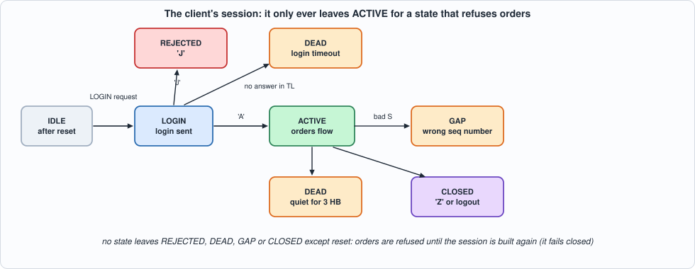
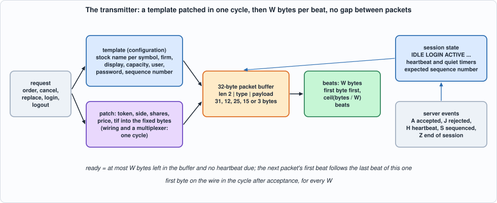
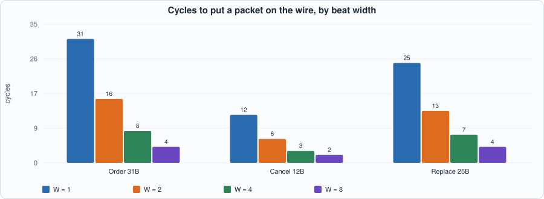
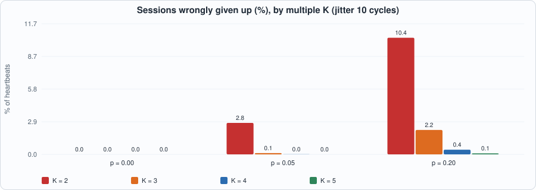

# 24. Order Entry: A Binary Protocol, Templates Patched in One Cycle, and the Client Side of a Session That Fails Closed


--8<-- "docs/assets/art/ch-24.md"


**What you will see:** the gate of Chapter 23 says an order may go; this chapter puts it on the wire. An order entry protocol is a stream of small fixed-layout binary messages inside a **session** (login, heartbeats, sequence numbers). The design that is fast is a **template**: everything in the message that does not change (the message type, the stock's name, the firm, the length) is already in registers, and the few fields that do (token, side, shares, price) are patched in by wiring, **in one cycle**, whatever the message; the 31 bytes then leave `W` at a time. Around it is the **client side of the session** as a small state machine that fails closed: it refuses orders until it has logged in, and it stops sending when the server falls silent or the sequence of its messages breaks. The chapter writes the protocol and the session as a specification (and checks the specification's bytes against Python's `struct` module), builds the transmitter, tests it **beat for beat and cycle for cycle**, and measures what the beat width buys.

**What you need to know first:** Chapter 16 (message layouts and the bytes of a protocol), Chapter 13 (timers and liveness) and Chapter 20 (a model in which time is part of the specification).

**What this chapter builds:** `rtl/sess.sv` (`sess` and the pin wrapper `sess_syn`), `model/sess_gold.py` (the protocol, the session, the closed loop and the stimulus), `tb/sess_tb.sv`, `tools/ch24_run.py`, `tools/ch24_example_a.py`, `tools/ch24_example_b.py`, `tools/mut_ch24.py`, `tools/make_figs_ch24.py`.

!!! warning "The protocol is the book's own"
    **The packet layouts below are a simplified, OUCH- and SoupBinTCP-like protocol written from memory for this book. They are not any exchange's specification and have not been checked against one.** The engineering (template patching, a session state machine, heartbeats and liveness, a sequence check) carries over; the field offsets and the message types do not, and a real exchange's certification suite is the test that matters before any of this touches a market.

!!! note "Scope: what this chapter leaves out, on purpose"
    **The transmit side only**: the receive side is two events the unit is *told* about (a server packet's type and sequence number), not parsed here (Chapter 16's parser is the model for it). **No retransmission**: a gap in the server's sequence is the end of the session (GAP), as in the protocols this imitates. **No TCP**: the unit's output is a byte stream; Chapter 12 to 15's stack carries it. **Beat widths 1 to 8 bytes**; at most 15 symbols (`NS <= 15`, a 4-bit index); one request at a time, held until it is accepted. **Cut-through is not built**: the packet is formed completely before the first byte leaves (one cycle), so a field that arrives late could not be patched into a packet already leaving (Exercise 2). This is a model of a design, not a product.

## The protocol and the session

`model/sess_gold.py` states the protocol in its docstring and in an encoder that builds each packet with `bytes` and `int.to_bytes`. A packet is a 2-byte length (of everything after it), a 1-byte type and a payload, all numbers big endian:

| packet | type | payload | bytes on the wire |
|---|---|---|---|
| login | `L` | user(4) password(4) requested sequence number(4) | 15 |
| client heartbeat | `R` | none | 3 |
| logout | `O` | none | 3 |
| data | `U` | **enter order** `O`: token(4) side(`B`/`S`) shares(4) stock(4) price(4) tif(4) firm(4) display(1) capacity(1) | 31 |
| | | **cancel** `X`: token(4) shares(4) | 12 |
| | | **replace** `N`: old token(4) new token(4) shares(4) price(4) tif(4) display(1) | 25 |

From the server the unit sees events `(type, sequence number)`: `A` login accepted (the number the session continues from), `J` rejected, `H` heartbeat, `S` sequenced data (its number must be the next expected one), `Z` end of session.

**Templates.** The stock name of each symbol (a 4-byte name per symbol index), the firm, the display and capacity bytes, the user, the password and the requested sequence number are **configuration**, written at any time. An order is the template with the token, side, shares, price and tif patched in.

**The session.** States: IDLE after reset; LOGIN once a login request has been accepted; ACTIVE on `A`; REJECTED on `J`; DEAD if no answer comes within `TL` cycles of the login, or if nothing is heard from the server for `3 HB` cycles in ACTIVE; CLOSED on `Z` or after a logout; GAP on an `S` whose number is not the expected one. **No state leaves REJECTED, DEAD, GAP or CLOSED except reset**: orders are refused until the session is built again. That is the fail-closed rule of Chapter 23 applied to a connection.


*Figure 24.1: the client's session states.*

**Requests** are offered one at a time and held until accepted: `ORDER`, `CANCEL`, `REPLACE`, `LOGIN`, `LOGOUT`. The unit answers each, in the cycle after it accepts it: **OK** (the packet is on its way), **REFUSED** (the session is not in the state that allows it: `LOGIN` is allowed in IDLE, the others in ACTIVE) or **BADSYM** (an order for a symbol index of `NS` or more). A refused request sends nothing.

**Heartbeats.** In ACTIVE, if `HB` cycles have passed since a packet was last loaded, a heartbeat is sent in the first cycle the transmitter is free, **ahead of any request** (the request waits one cycle: `ready` is low in that cycle).

**Time.** `ready` is high when the transmitter has at most `W` bytes left (the last beat is leaving, or nothing) and no heartbeat is due. A packet accepted in cycle `a` is on the wire in cycles `a + 1` to `a + ceil(bytes / W)`, one beat per cycle, and the next packet's first beat can follow in the very next cycle: no gap between packets.

```python
--8<-- "model/sess_gold.py"
```

The self-test works out by hand: the bytes of every kind of packet (written as hexadecimal literals); the timeline of a login (accepted in cycle 7, beats of 8 and 7 bytes in cycles 8 and 9, `ready` low in 8 and high in 9, ACTIVE from cycle 12); the login timer (DEAD six cycles after the login); the quiet timer (DEAD twelve cycles after the last word from the server, and a server heartbeat that restarts the count); a sequence gap; refusals in every state; a symbol that does not exist; and the heartbeat that goes ahead of a request.

## The hardware


*Figure 24.2: the transmitter.*

- **One cycle to form the packet.** The template's fixed bytes are registers; each packet kind is a *concatenation*: `{16'h001D, 8'h55, 8'h4F, in_tok, side_c, in_shares, stk, in_px, in_tif, firm, display, capacity, 8'h00}` is a 32-byte word whose bytes are the order's, in the order they leave. Picking the packet is a multiplexer on the request kind; loading it is one register write. There is no byte-by-byte assembly, so the time to the first byte does not depend on the packet or on `W`.
- **The beats.** The 32-byte buffer and a byte count `txlen`; each cycle the top `W` bytes are the beat (`o_data`), and the buffer shifts left `8 W` bits. The last beat has `txlen <= W` bytes; the rest of its bytes are zero. A new packet is loaded in the cycle the last beat leaves.
- **The session** is `st`, three counters (`hbc` since the last packet, `rxc` since the server was last heard, `ltc` since the login) and the expected sequence number; one `always_comb` computes the next state from the server's event and the timers, and an accepted request's transition (LOGIN or CLOSED) is applied last.
- **Simplifications that the mutation run found** (see below): a counter or a reset that cannot matter is not there. The session goes through LOGIN and ACTIVE once between resets, so `ltc` and `rxc` need no clearing on entry; the heartbeat count is cleared by any cycle outside ACTIVE, so it needs no reset.

```systemverilog
--8<-- "rtl/sess.sv"
```

## The tests

```systemverilog
--8<-- "tb/sess_tb.sv"
```

```python
--8<-- "tools/ch24_run.py"
```

To run: `python3 tools/ch24_run.py` (a few minutes). Recorded output:

```text
--8<-- "out/ch24_run_out.txt"
```

**Reading the output.**

- **Section 2** checks the specification's *bytes* against an encoder written with `struct.pack` (a different way of writing the same layout): **0 of 2,000 random packets differ**, and the sizes on the wire are 31, 12, 25, 15, 3 and 3 bytes. It also shows what the eight scenarios contain: how many cycles are spent in each state, which packets were sent, and which answers were given.
- **Section 3: the transmitter equals the model in all 55 runs** (5 formats, 11 scenarios), in Icarus (every register powered up with garbage: a session already ACTIVE, a transmitter with bytes in it, config registers full of `DEADBEEF`) and in Verilator. Every beat (data, `last`, byte count), the state, the expected sequence number, `ready` and every answer are compared in the cycle the model says.
- The eleven scenarios: *normal* (login, orders, cancels, replaces, server heartbeats and sequenced data); *reject* (`J`); *silent* (the login is never answered: DEAD after `TL`); *dead* (the server speaks for a while, then falls silent); *gap* (a wrong sequence number); *close* (`Z`); *logout*; *random* (a mix with random server events); *closelogin* (`Z` while logging in, and a late `A` that must change nothing); *limit* (server heartbeats spaced **exactly** `3 HB` apart, each the last cycle that saves the session, and then one cycle too late); *bare* (a session that was never configured).
- The formats include the byte-wide beat (`W = 1`), `NS = 1` (the symbol index never needs a second bit), 15 symbols, and heartbeat and timeout values as small as 7 and 15 cycles so that the timers fire often.

## Running example A: what it costs and how fast it runs

```python
--8<-- "tools/ch24_example_a.py"
```

To run: `python3 tools/ch24_example_a.py` (a few minutes). Recorded output:

```text
--8<-- "out/ch24_example_a_out.txt"
```

- **Measured:** the transmitter is **870 to 909 LUTs and 893 flip-flops on iCE40 at 63 to 76 MHz, 882 to 906 LUTs at 104 to 109 MHz on ECP5**, almost independent of `W` (1 to 8 bytes): the 256-bit buffer and the template do not grow with the beat width, only the width of the beat taken out. **Fifteen symbols** cost 1,151 LUTs and 1,245 flip-flops on iCE40 (75 MHz) and 1,925 LUTs on ECP5 (93 MHz): each symbol is a 32-bit register of its own and a multiplexer input.
- **The clock is limited by the session counters, not by the packet**: the critical path is the heartbeat counter's comparison with its limit and its reset (`hbc -> hbc`: 5.8 ns of logic and 7.6 of routing on iCE40, 3.5 and 6.1 on ECP5) or the timers feeding the state, which decide `ready` and the load. **Nothing here reaches 125 MHz**; the fix is to count down (a counter that is zero is a one-input test) or to register `hb_due` a cycle ahead (Exercise 3), at the cost of one cycle of imprecision in the heartbeat period that the specification would have to state.
- **What it means for the wire (derived):** an order is 31 bytes, **4 beats at `W = 8`**, so at 108.8 MHz its last byte leaves 37 ns after it is accepted and its **first byte after 9 ns**. A 10 Gb/s MAC consumes 8 bytes per 6.4 ns (156.25 MHz): this unit at 108 MHz and `W = 8` is slower than the line, so between the transmitter and a 10G MAC there must be a FIFO that is filled at 108 MHz and drained at 156 MHz, or the beat must be 16 bytes (not built here) so that the 8-byte MAC rate is met with 78 MHz. A latency budget that says "4 cycles" has to say whose cycles.

## Running example B: wire time and liveness

```python
--8<-- "tools/ch24_example_b.py"
```

To run: `python3 tools/ch24_example_b.py`. Recorded output:

```text
--8<-- "out/ch24_example_b_out.txt"
```


*Figure 24.3: cycles to put each packet on the wire, by beat width.*


*Figure 24.4: sessions wrongly given up, by the multiple K of the heartbeat period.*

- **Wire time is `ceil(bytes / W)` and nothing else.** An order is **31 cycles at `W = 1`, 16 at 2, 8 at 4, 4 at 8** (2 at 16, arithmetic only); a cancel is 12, 6, 3, 2; a heartbeat is 3, 2, 1, 1. The first byte is always on the wire the cycle after acceptance, for every `W`.
- **The multiple `K = 3` is a tradeoff, and the data says how.** With the server's heartbeat every 20 cycles and a delay of up to 10, the share of sessions **wrongly given up** (server alive, but a gap of `K x HB` with no heartbeat) is, with 5% of server heartbeats lost: **2.81% at K = 2, 0.11% at K = 3, 0.01% at K = 4**; with 20% lost: 10.4%, 2.2%, 0.42%, 0.09% for K = 2 to 5. A jitter larger than the period (30 against 20) gives 6.7% false give-ups at `K = 2` **with no loss at all**. The price of a larger K is a slower detection of a dead server: in the cycle model it is **3.05 HB** at `HB = 20` (61 cycles: 3 `HB` plus one for the registers), 151 cycles at `HB = 50`: a session that is dead takes `K x HB` to be called dead, and the orders sent in the meantime go nowhere.
- **Heartbeats are traffic only when nothing else is.** At an order rate of 0.01 per cycle, **79% of the packets sent are heartbeats**; at 0.05 it is 35%, at 0.1 it is 11.5%: a busy session never needs one (any packet restarts the count), an idle one sends nothing else.

## Testing the tests

Two families of mutants: the **RTL** (95 mutants; battery: the transmitter against the cycle model on five formats and eleven scenarios) and the **model** (19 mutants; battery: the model's own hand-checked scenarios, the bytes of every packet written out by hand and the timelines worked cycle by cycle).

```python
--8<-- "tools/mut_ch24.py"
```

To run: `python3 tools/mut_ch24.py` (a few minutes). Recorded output:

```text
--8<-- "out/ch24_mut_out.txt"
```

**Result: 114 of 114 caught**, after a first run that caught 101 of 121. The twenty survivors:

| survivor of the first run | why | what was done |
|---|---|---|
| (RTL) `o_last` written as "a full last beat or a short one" | **equivalent**: it is the same condition as `txlen != 0 and txlen <= W`; the mutant was badly written | dropped |
| (RTL) an end of session is ignored while logging in | **a missing test** | scenario *closelogin* |
| (RTL) a server packet heard in the very cycle the quiet counter would give up does not save the session | **a missing test**: the boundary was never hit | scenario *limit*: server heartbeats spaced exactly `3 HB` apart, then one cycle too late; hand-checked in the model (the count restarts and DEAD comes at the cycle worked out) |
| (RTL) the quiet counter is not cleared on entering ACTIVE; the login timer is not cleared on a login | **equivalent**: the session goes through LOGIN and ACTIVE once between resets, and both counters are 0 from reset | the two clearings removed from the RTL and the model |
| (RTL) a heartbeat is sent while not active; the heartbeat count runs outside ACTIVE; reset does not clear the heartbeat count | **equivalent**: the count is cleared in every cycle outside ACTIVE, and the heartbeat is only due in ACTIVE | the count's gating simplified, its reset removed |
| (RTL) reset does not clear the user, the firm, the sequence number or the display | **a missing test**: every scenario configured everything first | scenario *bare*: a session that was never configured |
| (model) the heartbeat is sent when not active | **equivalent** (as above) | dropped |
| (model) `ready` needs an empty transmitter; a login is allowed when ACTIVE; orders are allowed after a GAP; an end of session is ignored while logging in; a logout does not close the session; a packet does not restart the heartbeat count; a stock write for a bad symbol overwrites symbol 0 | **missing hand-checked scenarios** | added, each worked cycle by cycle |

**Two earlier slips, found before the mutation run.** The first comparison of the transmitter with the model failed in every run because the harness compared the printed cycle number with the model's row without it (a test-harness bug, not a design bug). And one format (`NS = 16`) failed because the 4-bit symbol field of the stimulus cannot hold a symbol index of 16: the contract is `NS <= 15` and the stimulus overflowed into the next field.

## What this chapter established, and what it did not

**Established, with the tests that show it:** a transmitter that puts a request on the wire as the **bytes a specification says**, checked against an independent encoder and against hand-worked bytes; a **session** that fails closed and whose timers (login, quiet, heartbeat) are **exact to the cycle**, including the boundary cases (a heartbeat on the last cycle that saves the session); **gapless packets** and a first byte one cycle after acceptance for every beat width; the **cost** (about 900 LUTs, 63 to 109 MHz, nearly independent of `W`; 1,925 LUTs for 15 symbols on ECP5); the **liveness rule** measured (K = 3 gives 0.1% false give-ups at 5% loss and detects a dead server in 3 heartbeat periods); 114 of 114 mutants caught.

**Not established:** a clock near 125 MHz; **any exchange's real protocol** (the layouts are this book's); cut-through (patching a field after the first bytes have left); the receive side; retransmission; a MAC and a line rate (the FIFO between a 108 MHz transmitter and a 156 MHz MAC is the derivation above, not a build); that a *real* server's heartbeat jitter and loss look like Example B's.

## Self-check questions

1. What are the fields of an order, and where are they in the 31 bytes? Which are fixed by the template and which are patched?
2. Why does the first byte leave the cycle after acceptance whatever the packet and `W`? What does `ceil(bytes / W)` give for the last?
3. When is `ready` high, and why can the next packet follow the last beat with no gap? What does a due heartbeat do to a request?
4. Which states can an order be sent in, and why does no state leave DEAD, GAP, REJECTED or CLOSED except reset?
5. How long does a login wait for an answer, and how long does the session wait for a dead server? In which cycle is DEAD first visible?
6. What is the last cycle in which a server heartbeat saves the session, and why did a mutant survive until a test sent one exactly there?
7. What does the sequence check do with `S` number 53 when 52 is expected?
8. Why can the unit refuse an order with BADSYM and a login with REFUSED, and what does a refused request send?
9. Why does the width of the beat hardly change the logic?
10. What limits the clock, and what would you change (Exercise 3)?
11. How many cycles is an order on the wire at `W = 8`, and why must a design that feeds a 10G MAC say whose cycles those are?
12. Name two survivors of the first mutation run and say, for each, whether it was equivalent or a missing test, and what was done.

## Exercises

1. **A real protocol.** Take an exchange's published order entry specification (not the one in this chapter); which of the template, the session and the sequence rules of this chapter survive unchanged, and what must the model say that this one does not (a replay of unacknowledged messages, a sequence number in every client message)?
2. **Cut-through.** Start sending the first 16 bytes of an order (the type, the token, the side, the stock) while the price is still being computed by the signal unit of Chapter 22. What must the model say about a price that is late by one beat, and what does the wire see if the price never comes?
3. **Reach 125 MHz.** Replace the heartbeat counter by a down-counter loaded with `HB` and register `hb_due`; what happens to the heartbeat period (one cycle longer?) and to the specification? Measure on ECP5.
4. **A receive side.** Parse the server's packets (`A`, `J`, `H`, `S`, `Z`) from a byte stream with the parser generator of Chapter 16 and feed the unit's `rx` events from it. What happens when a packet is split across beats and a heartbeat is the only thing the server has sent for the last `K x HB` cycles?
5. **A mutant that survives.** Add a mutant to `tools/mut_ch24.py` that neither battery catches. Is it equivalent, outside the contract, or is a test missing?
