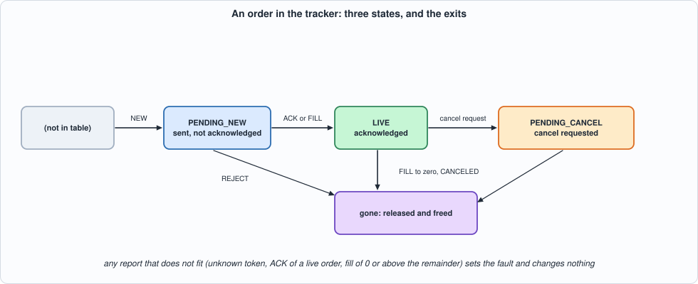
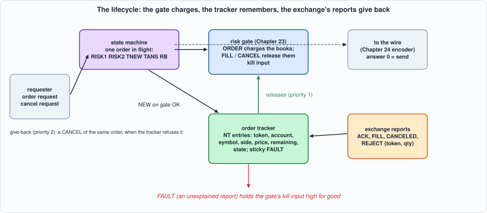
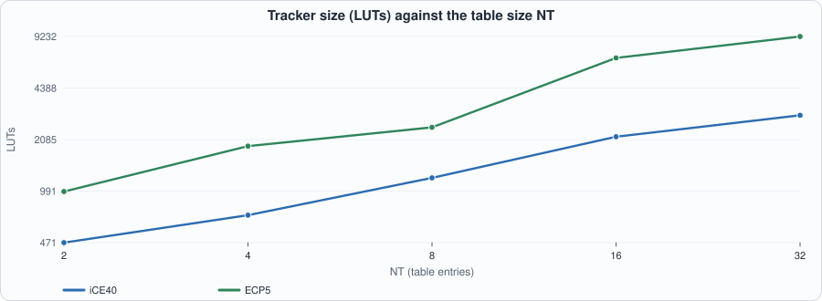
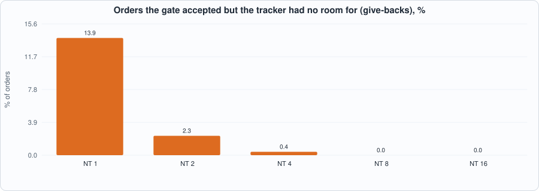

# 25. The Order Lifecycle: Tracking What Is Open, Giving Back What Is Not, and Keeping Two Books the Same


--8<-- "docs/assets/art/ch-25.md"


**What you will see:** Chapter 23's gate charges an order when it goes out; nothing yet gives the charge back. This chapter builds the memory that does: an **order tracker**, a table of the orders that are open (token, account, symbol, side, the price the gate was charged, the quantity left, a state), and the rules by which the exchange's reports (acknowledged, filled, cancelled, rejected) turn into **releases** to the gate. Two ideas carry it. First, a release carries the **order's own price**, so the notional given back is exactly the notional that was charged. Second, **a report the books cannot explain is not argued with**: the tracker sets a sticky fault, which holds the gate's kill input high for good. The chapter then joins the gate and the tracker with a small state machine (the order is charged, recorded, and if the tracker has no room the charge is **given back**) and checks the property the design exists to keep: **the gate's books and the tracker's books describe the same orders**.

**What you need to know first:** Chapter 23 (the gate and its event format: FILL and CANCEL release what an order took), Chapter 24 (the order is sent only after the gate says OK) and Chapter 20 (a model in which time is part of the specification).

**What this chapter builds:** `rtl/track.sv` (`track` and `track_syn`), `rtl/life.sv` (`life`: gate + tracker + state machine, and `life_syn`), `model/life_gold.py` (the tracker's specification), `model/sys_gold.py` (the joined design's specification and the reconciliation check), `tb/life_tb.sv`, `tb/sys_tb.sv`, `formal/track_props.sv`, `tools/ch25_run.py`, `tools/ch25_sys.py`, `tools/ch25_formal.py`, `tools/ch25_example_a.py`, `tools/ch25_example_b.py`, `tools/mut_ch25.py`, `tools/mut_ch25_sys.py`, `tools/make_figs_ch25.py`. The risk gate (`rtl/risk.sv`) is Chapter 23's, **unchanged**.

!!! warning "The exchange's reports are the book's own"
    **The four reports (ACK, FILL, CANCELED, REJECT) carry a token and a quantity, and nothing else.** They are a simplification of what an exchange's execution reports say (no execution price, no execution id, no reason codes, no replace, no bust, no partial-cancel), and they are not any exchange's message set. A real feed must be mapped onto them, and a real exchange's own rules (what a fill of a cancel-pending order looks like, how a bust is reported) decide whether the tracker's anomaly rules are too strict.

!!! note "Scope: what this chapter leaves out, on purpose"
    **Replace and bust are out of scope** (Exercises 1 and 2). **One order is in flight at a time** between the gate and the tracker: the joined design takes an order every 5 to 6 cycles, not every cycle (the gate alone takes one per cycle); reports, releases and cancel requests are never held up by it. **Tokens are 32 bits; an order is identified by its token alone** (no per-session namespace). The formal proof is **bounded** (8 cycles, tokens 0 to 3, two table entries, quantities below 8). The timing numbers are for a placed model of the design, not a build.

## The specification

`model/life_gold.py` states the tracker in its docstring and in a small executable class; `model/sys_gold.py` states the joined design. In words:

- **The table.** `NT` entries. An order is in the table from the moment the requester records it (NEW) until it is finished. A finished order *leaves*, so a later report for its token is a report for an **unknown token**.
- **Local events** (from the requester), refused without a fault: `NEW` is refused with ZERO (quantity 0), DUPTOK (the token is open) or FULL (no free entry; the order must then not be sent); `CANCELREQ` is refused with UNKNOWN, or BADSTATE unless the order is LIVE, and makes a LIVE order PENDING_CANCEL.
- **Reports** (from the exchange): `ACK` only makes sense for a PENDING_NEW order; `FILL(qty)` takes `qty` from the remainder (0 is ZERO, above the remainder is OVERFILL), is an *implicit acknowledgement*, releases a FILL to the gate at the order's own price, and frees the entry at zero remaining; `CANCELED` releases the whole remainder as a CANCEL and frees the entry (in any state); `REJECT` is only for a PENDING_NEW order (otherwise BADSTATE) and releases the quantity as a CANCEL. **Every report that is not OK changes nothing, releases nothing and sets the sticky FAULT.**
- **Time.** One event per cycle; a report wins over a local event offered in the same cycle (`ready` is low and the requester holds its event). An event in cycle *c* is applied at its end; the answer, the release and the new live count are visible in cycle *c + 1*.


*Figure 25.1: an order in the tracker.*

**The joined design** (`life`): an order request is offered to the gate at once; the gate answers two cycles later. A refusal ends the order (the answer is the gate's code, 1 to 10). On OK the tracker is offered NEW. If the tracker refuses (ZERO, DUPTOK, FULL), the gate has been charged for an order that will not exist, so the state machine sends the gate a **CANCEL of the same account, symbol, side, price and quantity**, and the answer is 16 plus the tracker's code. The answer to an order is `d_res`: **0 means the order may be sent**, 1 to 10 are the gate's refusals, 16 to 22 the tracker's refusals (given back). The gate's event port has one user per cycle, in this priority: a release from the tracker, a give-back, a new order. And the tracker's fault is wired to the gate's kill input.


*Figure 25.2: the lifecycle.*

**Reconciliation**, the property under test, is checked by the model in every cycle in which the design is quiet (no order in flight, nothing waiting in the tracker's output register or in the gate's pipeline): for every account and symbol, the gate's open buys (sells) equal the sum of the remaining quantities of the tracker's buy (sell) orders, and the gate's open notional of an account equals the sum of *price × remaining quantity* over the tracker's orders.

## The hardware

- **The table is registers, searched at once.** Each entry's 32-bit token is compared with the event's token in parallel (`hit`, and the entry's index); a priority loop finds a free entry. No RAM: the lookup is one cycle, which a RAM-based hash (Chapter 20) would not give without more machinery.
- **One decision per cycle** (`always_comb`): the result code, the release, and what to write. The writes (record a new order, make LIVE, make PENDING_CANCEL, reduce the remainder, free) are separate enables.
- **Answers are qualified by their valid.** The answer fields are meaningful only when `o_valid` is high, the release fields only when `o_rv` is high. (The first version cleared them when idle; the mutation run showed that no test could tell, so the clearing is gone.)
- **The join** is a six-state machine (`IDLE RISK1 RISK2 TNEW TANS RB`) around two instances. The gate's event port is a three-way multiplexer whose priorities are in `give_back = (st == RB) && !t_rv`.

```systemverilog
--8<-- "rtl/track.sv"
```

```systemverilog
--8<-- "rtl/life.sv"
```

## The tests

The tracker has its own testbench and sweep (`tb/life_tb.sv`, `tools/ch25_run.py`); the joined design has another (`tb/sys_tb.sv`, `tools/ch25_sys.py`) that prints, every cycle, the answer to each order and each cancel request, **the gate's answer to every event it gets** (so every release the tracker makes is checked, with its account, symbol, side, price and quantity, by the effect on the gate's books), the live count, the fault and the state.

```systemverilog
--8<-- "tb/life_tb.sv"
```

```python
--8<-- "tools/ch25_run.py"
```

To run: `python3 tools/ch25_run.py` (several minutes). Recorded output:

```text
--8<-- "out/ch25_run_out.txt"
```

```systemverilog
--8<-- "tb/sys_tb.sv"
```

```python
--8<-- "tools/ch25_sys.py"
```

To run: `python3 tools/ch25_sys.py` (several minutes). Recorded output:

```text
--8<-- "out/ch25_sys_out.txt"
```

**Reading the output.**

- **The tracker equals the model in all 30 runs** (5 table sizes, 6 traffic mixes), in Icarus (every register powered up with garbage: entries in use with `DEADBEEF` tokens, a set fault) and in Verilator. *clean* is well-formed traffic; *full* keeps the table full; *near* uses tokens that differ in one bit (a comparison that ignores a bit is caught); *burst* sends a report every cycle (the requester starves); *fault* and *random* inject each kind of anomalous report.
- **The joined design equals the model in all 18 runs and in the 14 collision runs**, in both simulators (3 table sizes, 6 mixes, 419 cycles each). The mixes: *flow* (generous limits), *tight* (small limits: the gate refuses on every rule), *dups* (tokens reused a moment after they were issued, so the tracker meets duplicates), *faults*, *cancels*, *random*.
- **Reconciliation: the books differ in 0 of the quiet cycles checked** (72 to 121 in the NT 4 runs listed). The model has a check that sees a difference in the buys, in the sells and in the notional separately (the self-test corrupts the gate's books on purpose and requires the check to fire).
- **The collision cases.** The one place the priorities of the event port matter is when a give-back is waiting while a release from the tracker arrives. Random traffic almost never makes it happen, so `collide(k)` is a directed scenario: a duplicate order (which will need a give-back) and a fill report delayed by *k* cycles. In 1 of the 14 delays the two meet; the release goes first, and the books still agree afterwards.
- **What the sweeps did not reach:** the seed-1 *faults* run happens to inject no anomalous report before the traffic ends (its single KILL is the external kill input); the path *tracker fault → gate kill* is exercised by the *random* run (79 KILL answers) and by the hand-checked scenario in `sys_gold.py`.

## Running example A: what it costs and how fast it runs

```python
--8<-- "tools/ch25_example_a.py"
```

To run: `python3 tools/ch25_example_a.py` (a few minutes). Recorded output:

```text
--8<-- "out/ch25_example_a_out.txt"
```


*Figure 25.3: the tracker's LUTs against the table size.*

- **Measured:** the tracker is **471 LUTs at 2 entries to 2,960 at 32 on iCE40 (53.0 down to 23.0 MHz)**, and 985 to 9,232 LUTs on ECP5 (57.2 down to 25.8 MHz). The joined design is **3,767 LUTs (6,254 logic cells) at 29.1 MHz on iCE40 with 4 entries and 4,713 LUTs at 37.5 MHz on ECP5**. **At 16 entries it does not fit the HX8K** (9,037 logic cells against 7,680: `no fit`), and reaches 34.6 MHz on ECP5. **The asked-for 300 MHz is nowhere near**: this is a registers-and-comparators design written for clarity, not for speed.
- **The flip-flop counts are inflated by the pin wrapper** (a 300-odd-bit shift register of inputs and the output registers); the tracker's own flip-flops are the table (76 per entry: 32-bit token, account, symbol, side, 16-bit price, 16-bit remainder, state, in-use bit).
- **The clock is limited by the lookup and its consequences**: the critical path starts at the inputs (token compare against every entry, then the hit index, then the write enables) and ends at the table's `used` bits or the fault; in the joined design it runs through the gate's stage 2 (`ev_sym -> os`, `s1_a -> tok`).
- **The ECP5 LUT counts for the tracker are higher than iCE40's** (for example 6,772 against 2,171 at 16 entries); I have **not investigated why** (the mapping of the 32-bit comparisons and the priority loops differs between the two flows).
- **What it means (derived):** the associative table is the right shape for 4 to 16 live orders and the wrong one for hundreds; a design with many live orders needs a hash table (Chapter 20) and a different anomaly story (a lookup that can miss for a *collision* reason, not only for an unknown token).

## Running example B: latency, a fault study, and the table size

```python
--8<-- "tools/ch25_example_b.py"
```

To run: `python3 tools/ch25_example_b.py` (under a few minutes). Recorded output:

```text
--8<-- "out/ch25_example_b_out.txt"
```


*Figure 25.4: the share of orders the gate accepted but the tracker had no room for.*

- **Latency (model, checked against the RTL by the sweep):** an order is answered **3 cycles** after it is offered if the gate refuses it, **5** if both accept, **6** if the tracker refuses and the charge is given back, and 7 if a report from the exchange takes the tracker's cycle. An order every 5 to 6 cycles is this design's rate.
- **The fault study (300 trials; model):** after one report the books cannot explain, a trial refuses **12 to 75 orders (mean 44)** with KILL, the first about **6.7 cycles** after the bad report (4 at least), and **at most one** order that was already in flight is still sent. The books still agree in every quiet cycle (**0 differences**): failing closed stops *new* orders, it does not corrupt what is already open.
- **Table size:** with traffic that fills the table (each size has its own generated traffic, reporting only on orders the table holds), **13.9% of orders are accepted by the gate and then given back at 1 entry, 2.3% at 2, 0.4% at 4, none at 8 and 16**. The give-back is the price of a table that is too small, and it is a correct price: the gate's books were never left charged.
- **Not measured:** real fill and cancel timing of any exchange; the fault study's single anomalous report (a fill for an unknown token) stands for all kinds, which the tracker treats alike.

## The formal proof

`formal/track_props.sv` drives the tracker with free inputs and keeps its own account **indexed by token** (the tracker is indexed by table entry), with the cumulative quantity released for each token. It asserts, one cycle after every event: **T1** no over-release (released plus remaining equals the original, never more); **T2** an order that leaves has been released exactly its original quantity; **T3** a release is for an open order and carries that order's own account, symbol, side and price; **T4** the answer, the live count and the fault equal the specification's; **T5** an anomalous report changes nothing.

```systemverilog
--8<-- "formal/track_props.sv"
```

```python
--8<-- "tools/ch25_formal.py"
```

To run: `python3 tools/ch25_formal.py` (a few minutes). Recorded output:

```text
--8<-- "out/ch25_formal_out.txt"
```

**Result: proved for 8 cycles from reset (99 s), and 8 of 8 mutants found.** This is a **bounded** proof: nothing is said about cycle 9, about more than two entries, tokens above 3 or quantities of 8 and above. A ninth mutant ("an anomaly still releases") was **not** found, and the reason is a lesson: it was **equivalent**, because the line it removed (`rel = 0; do_fill = 0; ...` on an anomaly) cleared signals that are only ever set in the non-anomalous branches. The line was deleted from the RTL.

## Testing the tests

Four families of mutants. **Tracker RTL** (50 mutants; battery: the tracker against its model on 5 sizes and 6 mixes), **tracker model** (10; its hand-checked cases), **joined RTL** (33; the joined design against its model, plus the collision cases), **joined model** (6; its hand-checked scenarios, including the corrupted-books checks).

```python
--8<-- "tools/mut_ch25.py"
```

```python
--8<-- "tools/mut_ch25_sys.py"
```

To run: `python3 tools/mut_ch25.py` and `python3 tools/mut_ch25_sys.py` (several minutes each). Recorded output:

```text
--8<-- "out/mut_ch25_out.txt"
```

```text
--8<-- "out/mut_ch25_sys_out.txt"
```

**Result: 60 of 60 and 39 of 39 caught**, after first runs with survivors. The survivors, and what was done:

| survivor | why | what was done |
|---|---|---|
| (tracker RTL) the lookup "takes the highest hit" | **equivalent**: the mutant text was identical to the original (badly written) | dropped |
| (tracker RTL) the free entry is the highest rather than the lowest | **equivalent at the interface**: which entry holds an order is not observable (every later access is by token) | the "lowest free entry" wording removed from the specification |
| (tracker RTL) the answer code, the release type and the release quantity are not cleared when idle | **outside the contract**: the testbench only looks at them when the valid is high | the clearing removed from the RTL; the fields are qualified by their valid, and the specification says so |
| (tracker model, six mutants) zero order accepted, duplicate accepted, a cancel request in PENDING_NEW, overfill by exactly one, a fill that is not an implicit ack, a reject of a live order | **missing hand-checked cases** | a second hand-worked scenario, each rule on its own |
| (formal) "an anomaly still releases" | **equivalent** (see above) | the redundant clearing deleted |
| (joined RTL) a tracker release does not win the gate's port | **equivalent**: `give_back` already contains `!t_rv`, so the condition added by the mutant is always true | dropped |
| (joined RTL) a give-back does not win over a new order | **equivalent**: they are in different states (RB and IDLE) and can never both be present | dropped |
| (joined model) the release does not win the port; the reconciliation ignores sells or notional | **missing hand-checked cases** | the collision scenario (the release must come before the give-back) and three corrupted-books checks |

**Slips found before and during the runs.** The first sweep of the tracker failed on every fault-injection run at 5 table entries or fewer: **the generator's bug, not the design's**: for a remainder of 65,535 it built an overfill of 65,536, which wraps to 0 in the 16-bit field and became a ZERO. Another generator bug (an empty `randrange` at the start of one mix) crashed the first run of the joined battery. And four mutants' text had gone stale after the RTL was simplified (the run reports *BAD ANCHOR*, and they were rewritten).

## What this chapter established, and what it did not

**Established, with the tests that show it:** a tracker whose answers, releases, live count and fault equal the model in every cycle (2 simulators, 5 sizes, 6 mixes); a **release that returns exactly what was charged** (the order's own price; proved to depth 8 and checked by the books); a **sticky fault that fails closed** and, wired to the gate, refuses every later order while letting releases through; a **give-back** so that an order the tracker cannot hold never leaves the gate's books charged; **reconciliation** between the two books in every quiet cycle of every run; and 60 + 39 mutants caught after the survivors above were explained.

**Not established:** any exchange's real execution reports (the four here are this book's); replace and bust (Exercises 1 and 2); more than one order in flight between the gate and the tracker; an unbounded proof (the bound is 8 cycles, 2 entries, tokens 0 to 3); a hash table for many orders; a clock above 53 MHz on iCE40 or 57 on ECP5 (the tracker alone) and the joined design's 29 and 37 MHz; and that the generators' traffic looks like a real session's.

## Self-check questions

1. What does a tracker entry hold, and why does it keep the order's *price*, not just its quantity?
2. Which reports are anomalies, and what does the tracker do for each? Why does it not try to continue?
3. Why is a fill an implicit acknowledgement, and what does that make of an ACK that arrives after it?
4. What is the difference between a local refusal (FULL, DUPTOK) and a fault? Why are the first not faults?
5. What is the give-back, when is it needed, and what is the answer the requester sees?
6. In what order does the gate's event port serve its users, and why can a tracker release never be delayed?
7. State the reconciliation property. Why is it only checked in *quiet* cycles?
8. How does the proof's account differ from the tracker's, and why does that matter?
9. Why did "an anomaly still releases" survive the formal run, and why was deleting code the right response?
10. What did the fault study show about orders in flight when a fault happens, and about the books?
11. Why does the table size change how often the gate's accepted orders are given back, and is that a cost or a correctness property?
12. Name two survivors of the first mutation runs and say, for each, whether it was equivalent, outside the contract or a missing test, and what was done.

## Exercises

1. **Replace.** Add REPLACE to the model (a new token and quantity for a LIVE order, acknowledged or rejected by the exchange). What does the gate see (a release of the old charge and a new charge, in which order, and what if the new charge fails the limits)? What new states does the tracker need?
2. **Bust.** An exchange can cancel a fill after the fact. What must the gate's position do, which of Chapter 23's invariants break, and what must the tracker remember that it does not now?
3. **Many orders.** Replace the associative table by the hash table of Chapter 20 with the token as the key. What new refusal appears, how does the anomaly story change (an unknown token and a collision overflow are not the same), and what does Example A become?
4. **A pipelined join.** Allow a second order into the state machine while the first waits for the gate. What can go wrong with the tracker's FULL answer and the gate's charge? What must the give-back carry?
5. **A longer proof.** Raise the proof's depth to 12 and the table to 3 entries. How does the time grow, and what does that tell you about where the bound should be spent?
6. **A mutant that survives.** Add a mutant to `tools/mut_ch25.py` that neither battery catches. Is it equivalent, outside the contract, or is a test missing?
