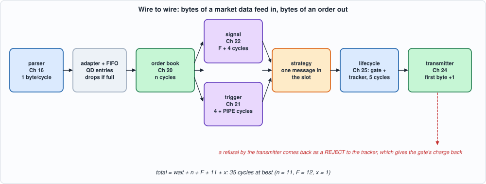
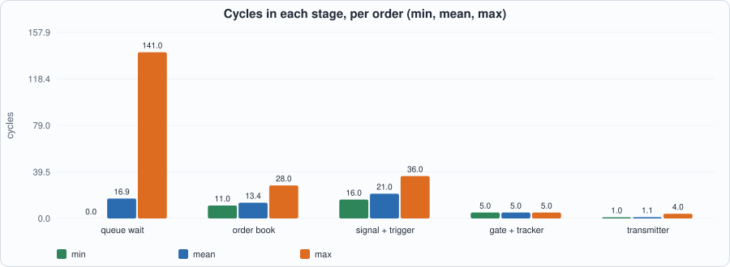
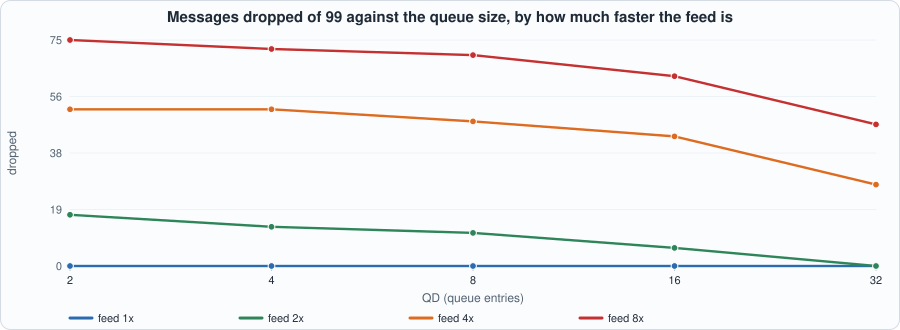

# 26. Wire to Wire: Chaining the Units into One Design and Writing Down Where Every Cycle Goes


--8<-- "docs/assets/art/ch-26.md"


**What you will see:** twenty-five chapters built units; this chapter connects them. Bytes of a MoldUDP64 + ITCH feed go in at one end; bytes of an order entry stream come out at the other, and in between a message passes the **parser** (Chapter 16), an **adapter and a queue**, the **order book** (Chapter 20), the **signal unit** (Chapter 22) and the **trigger engine** (Chapter 21) in parallel, a **strategy** (one comparison), the **lifecycle** of Chapter 25 (risk gate and tracker) and the **transmitter** (Chapter 24). The chapter's product is not a faster unit but a **cycle budget**: for every order, the number of cycles in each stage from the last byte of the message that caused it to the first byte of the order, with a closed form that is checked against every order of every test. The whole design is tested against a composed specification **in every cycle, every output**, in two simulators; and what the glue does that no unit's own test could show (queue drops, a transmitter that refuses what the gate charged, two users of one port) is found by mutation testing.

**What you need to know first:** Chapters 16 (the parser's timing), 20 to 25 (each unit's specification and its time), and the habit of Chapter 20: *time is part of the specification*.

**What this chapter builds:** `rtl/w2w.sv` (`w2w`, the glue, and `w2w_syn`), `model/w2w_gold.py` (the composed specification, with the stepped transmitter and five scenarios worked by hand), `tb/w2w_tb.sv`, `tools/ch26_run.py`, `tools/ch26_example_a.py`, `tools/ch26_example_b.py`, `tools/mut_ch26.py`, `tools/make_figs_ch26.py`. The units themselves (`mold_itch.sv`, `book2.sv`, `sig.sv`, `trig.sv`, `risk.sv`, `track.sv`, `life.sv`, `sess.sv`) are **unchanged**.

!!! warning "A model of a design, not a product"
    **This is a wire-to-wire pipeline for study.** The market data and the order entry protocols are the book's own simplifications (Chapters 16 and 24); the "strategy" is one comparison that is not a trading strategy; the latencies are cycle counts of a placed *model*, and the design does not fit the HX8K. Nothing here has been connected to a market or tested against an exchange's certification, and nothing here is investment advice.

!!! note "Scope: what this chapter leaves out, on purpose"
    **One message at a time between the book and the strategy** (the `slot`, below): the design is correct and simple and it is *not* a one-message-per-cycle pipeline; Example B shows what that costs. **A one-byte-per-cycle parser** (Chapter 17's wide parser is the exercise). **No Ethernet, IP, UDP or TCP** (Chapters 12 to 15's stack is not in this path; the bytes enter as the parser's stream). **The register interface and DMA to the host** that the contents list for this part are not in this chapter. **Queue depth QD is at least 2**, and a **control request** (login, logout) must not be offered in the same cycle as an order answer.

## The specification

`model/w2w_gold.py` states the path in its docstring and executes it, one cycle at a time, by calling the units' own models: the parser's cycle for each message (Chapter 16's `decode`), the book's cycles for each event (Chapter 20), the signal's numbers (Chapter 22), the trigger's table and rules (Chapter 21), the gate and tracker (Chapter 25's `Sys`, stepped) and the transmitter (Chapter 24's model, made into a class that is stepped and checked against the original on 30 random sessions). In words:

- **Parser.** A message whose last byte is in cycle *e* appears in cycle *E = e + 1*.
- **Adapter and queue.** A and F become ADD, E EXEC, X CANCEL, D DELETE, U REPLACE; S, P, unknown types, messages with an error (the parser's codes 1 and 2) and any symbol of **NS or more** are dropped before the queue. The reference is the low 32 bits of the 64-bit reference. The event is pushed in cycle *E* into a FIFO of `QD` entries; **if the FIFO is full in that cycle the message is dropped and counted.**
- **Book.** In the first cycle *a ≥ E + 1* in which the book is ready **and the strategy slot is free** the head event is accepted; the book takes *n* cycles (Chapter 20's rules) and its result is visible in cycle *r = a + n*.
- **Signal and trigger.** Both are offered the result in cycle *r*. The signal answers in *d = r + F + 4*; the trigger (offered the event as accepted, the symbol index as the key) answers in *r + 4 + PIPE* and its `fire` is kept until *d*.
- **Strategy**, in cycle *d*: if the trigger fired, the book applied the event (result OK), both sides are present, the book is not crossed or locked and the **imbalance is at least +THR (buy at the ask) or at most −THR (sell at the bid)**, an order of `OQ` shares at that price is offered to the lifecycle **in cycle *d* only**: if the lifecycle is not ready (an order or a release is using it) the order is **missed** and counted. The slot is held from *a* to *d*: one message at a time between the book and here, so that nothing has to be matched up afterwards.
- **Lifecycle and transmitter.** The gate and tracker answer 5 cycles after the offer; an answer of 0 is offered to the transmitter in that cycle (held if the transmitter is not ready: one held order is enough, since the next answer is at least 24 cycles later and the transmitter is busy for at most 31). **A transmitter that refuses an order (the session is not ACTIVE) makes the design report a REJECT of that token to the tracker**, which gives the gate's charge back; an exchange report that arrives in the same cycle wins the report port and the REJECT waits.


*Figure 26.1: the path of a message.*

**The closed form of the budget** follows: the cycles from the last byte of the message to the first byte of the order are **wait + n + F + 11 + x**, with *wait* the cycles in the queue, *n* the book's cycles, *F + 4* the signal, 5 the lifecycle, and *x* the cycles from the gate's answer to the first byte (1 if the transmitter is ready). The smallest possible is **35 cycles** (*wait* 0, *n* 11 for an ADD on an empty side, *F* 12, *x* 1).

## The hardware

- **The glue is small**: 459 LUTs of the 9,975 the units add up to (Example A). It is an adapter (a `case` on the message type), a register FIFO, the strategy (one comparison and two subtractions), a counter, and the send and reject logic.
- **The strategy slot is the one design decision**: `slot` is set when the book accepts an event and cleared when the signal answers. While it is set the queue is not read, so the trigger's `fire` and the book's result and symbol (kept in registers) belong to the event the signal's answer is about. A pipelined strategy would need those carried along with the event, and a FIFO of them; the price of the slot is that the design takes one message per `n + F + 5` cycles (Example B).
- **Three places where one thing is used by two**: the gate's event port (Chapter 25's priority: a tracker release, a give-back, a new order), the **tracker's report port** (the exchange's report first, the design's own REJECT second) and the **transmitter's request port** (a control request first, an order second). Each is a place where the units were correct alone.
- **Fields that the adapter forces**: for E, X and D the side and the price are not in the message, so the adapter sets them to 0 instead of letting the parser's registers (which keep the previous message's values) leak through.

```systemverilog
--8<-- "rtl/w2w.sv"
```

## The tests

```systemverilog
--8<-- "tb/w2w_tb.sv"
```

```python
--8<-- "tools/ch26_run.py"
```

To run: `python3 tools/ch26_run.py` (about 15 minutes: every mix in two simulators). Recorded output:

```text
--8<-- "out/ch26_run_out.txt"
```

**Reading the output.**

- **Section 3: the whole design equals the model in all 17 mixes, in Icarus and in Verilator**, in every cycle, in every printed output: the queue length and the drop count, the book's accept and answer, the signal's, the strategy's offer and take, the counters, the lifecycle's 18 outputs (including the gate's answer to every event it gets, so every release is checked by its effect on the gate's books) and the transmitter's 9 (so **every byte of every order on the wire**). The Icarus runs have no garbage powerups here: each unit's reset was tested in its own chapter.
- **Twelve generated mixes and five worked by hand.** *normal*, *dense* (messages back to back), *dense_clean* (no unusable messages), *slow*, *refuse* (the server stops its heartbeats halfway: the session dies and the transmitter refuses), *close* (the server ends the session), *faults* (an exchange report the books cannot explain: the tracker's fault kills the gate), *burst* (almost only cancels and executes), *slowsig* (F = 32 and a queue of 4: the queue backs up, a message waits 141 cycles, but none is dropped), *collide* (a report is timed to arrive one cycle before a decision, so the lifecycle is busy and an order is missed), *narrow* (a one-byte transmitter) and *openbook* (no reports, so the tracker's table fills). The five worked by hand are below.
- **The worked scenarios are the model's independent check.** *hand*: an ask of 10 and then a bid of 100: **the first byte of the order is on the wire 34 cycles after the second message appears** (35 after its last byte), as 8, 8, 8 and 7 bytes; every step of that arithmetic (11 cycles in the book, 16 in the signal, 5 in the lifecycle, 1 in the transmitter) was written down before the model gave it. *edge*: the imbalance **exactly at the threshold, +512 and −512** (9/16 and 7/16 of the shares): both orders are taken, and a repeated ADD (the book answers DUPREF) does not make a third. *dead*: the session is dead before the order: refused, rejected, the gate's charge back at 0. *dead2*: the same, with an exchange fill arriving in the very cycle the design's REJECT is waiting for the report port: the first order has 8 shares left, the second is gone. *queue*: five deletes 21 cycles apart with a queue of two and F = 32: **exactly one is dropped and the accepts are at E + 1, 45, 89 and 133**.
- **What the numbers say about the traffic** (section 2): of 17 mixes' orders the gate refuses some on the price band (symbol 3's band excludes the prices traded: the lifecycle's refusal path is exercised at the wire level), the transmitter refuses 8 and 15 in *refuse* and *close*, one order is missed in *collide*, and the queue drops one message in *queue* (the only drop in these runs: with the realistic traffic of the other mixes, the slow signal makes messages wait but not overflow a queue of 4).

## The cycle budget

The last section of the output is the table this chapter exists for. Over all 105 orders of all mixes:


*Figure 26.2: cycles in each stage, per order (minimum, mean, maximum).*

- **Measured (model, equal to the RTL on every mix):** from the last byte of the message to the first byte of the order, **35 cycles at best, 59.3 on average, 197 at worst**. The average is dominated by waiting: the queue wait is 16.9 cycles on average and **141 at worst** (the *slowsig* mix, where the signal takes 36 cycles and the queue backs up).
- **The fixed parts:** the gate and tracker take exactly 5 cycles; the transmitter's first byte is 1 cycle after the answer (up to 4 if it was still sending the previous packet); the signal and trigger take F + 4 = 16 cycles with F = 12.
- **The book is the variable part among the stages that are not queues:** **11 to 28 cycles, mean 13.4**, by the event (Example B, section 2: an ADD that creates a level 11 to 18, a REPLACE 20 to 34, the rule's worst case 36).
- **The closed form is exact: 0 wrong of 105 orders** (Example B, section 1).
- **By the message that caused the order:** 80 ADDs, 10 EXECs and 15 REPLACEs; the smallest total for a REPLACE is 44, since a REPLACE costs the book at least 20 cycles.

## Running example A: what it costs and how fast it runs

```python
--8<-- "tools/ch26_example_a.py"
```

To run: `python3 tools/ch26_example_a.py` (about 10 minutes). Recorded output:

```text
--8<-- "out/ch26_example_a_out.txt"
```

- **Measured, and a negative result: the whole design does not fit the iCE40 HX8K.** It needs **11,891 to 14,062 logic cells against 7,680** (7,034 to 7,997 LUTs and 5,793 to 7,083 flip-flops after Yosys has flattened it), so nextpnr reports `no fit` for all four configurations. On the ECP5 it fits (6,345 LUTs, 5,562 flip-flops) and reaches **37.2 to 43.1 MHz**, nowhere near the 300 MHz asked for.
- **Where the logic is** (unit by unit, before flattening, as mapped for iCE40): **the risk gate 2,852 LUTs, the signal unit 2,034, the book 1,832** (with 11 block RAMs), the transmitter 844, the trigger 814 (6 block RAMs), the tracker 683, the glue 459, the parser 264 and the lifecycle's state machine 149: **9,975 LUTs and 26 block RAMs in all**. (The flat count of about 7,000 is lower because the wrapper observes only 16 output bits and Yosys removes what cannot reach them.)
- **The flip-flop count is high** (5,800 to 7,100 flat) and mostly **not** state: the pin wrapper's 498-bit shift register is about 500 of them; the rest are the units' pipelines (the signal's 34, the risk gate's per-account arrays).
- **The clock is limited by the gate's second stage**, as in Chapters 23 and 25: the critical path ends at the token bucket (`gate.s1_s -> gate.tok[0]`: 8.9 ns of logic and 18.0 of routing at F = 12). Changing the queue (QD 4 to 16) or the signal's precision (F 12 to 24) moves the clock by only a few MHz.
- **What it means (derived):** to put this on a part, the risk gate needs its own pipelining (its stage 2 is what limits the clock) and the design needs an FPGA larger than the HX8K; the glue and the queue are not the problem.

## Running example B: the closed form, what the book costs, and what a faster feed does

```python
--8<-- "tools/ch26_example_b.py"
```

To run: `python3 tools/ch26_example_b.py` (under a minute). Recorded output:

```text
--8<-- "out/ch26_example_b_out.txt"
```


*Figure 26.3: messages dropped against the queue size, for a feed 1, 2, 4 and 8 times faster (model level).*

- **Section 1 (checked against the RTL's model on every order):** the closed form `wait + n + F + 11 + x` is exact for all 105 orders.
- **Section 2:** what the book costs by event: an ADD that is accepted 11 to 18 cycles (mean 13.2), a refusal (FULL, DUPREF, UNK) exactly **7** (the lookup), a zero-share ADD **1**, a REPLACE 16 to 34, and the worst the rules allow, **36**.
- **Section 3 (model level only: the message times are compressed and the RTL was not run on them):** the slot holds a message for **31.0 cycles on average**, and the one-byte parser delivers one message per 48.6 cycles in the *dense* stream, so the queue stays empty (the mean wait is 1.7 cycles). **A feed twice as fast already exceeds the design's service rate (a message per 24 cycles against 31): 17 of 99 messages are dropped with a queue of 2 and 6 with 16; it takes 32 entries to lose none. At 4 times 27 to 52 are dropped, at 8 times 47 to 75, whatever the queue.** The mean wait at those speeds is 340 to 620 cycles: the queue is simply full.
- **The lesson (derived, not measured on a build):** a deeper queue only postpones the loss once the feed is faster than the service; the cure is a shorter service time, that is, a pipelined strategy (the slot removed), and that is Exercise 1.
- **Not measured:** real feeds (this book's stream is a generator's), and a real parser at 8 bytes per cycle (Chapter 17's is the model for it).

## Testing the tests

Two families of mutants. The **glue** (`rtl/w2w.sv`: 74 mutants; battery: the whole design against the model, every output of every cycle, on the 17 mixes) and the **model** (`model/w2w_gold.py`: 9 mutants; battery: its self-test, which is the stepped transmitter against Chapter 24's model on random sessions and the five scenarios worked by hand). The units inside were mutation-tested in their own chapters and are not mutated again.

```python
--8<-- "tools/mut_ch26.py"
```

To run: `python3 tools/mut_ch26.py` (about 30 minutes). Recorded output:

```text
--8<-- "out/mut_ch26_out.txt"
```

**Result: 81 of 83 caught, and the two that are not are explained.** The first run caught **60 of 84**; the survivors, and what was done:

| survivor of the first run | why | what was done |
|---|---|---|
| (RTL) a symbol equal to NS is traded; a message with an error is queued | **missing tests**: the stream had one message past the table (and not always the first one), and only unknown-type errors, which the adapter's `case` drops anyway | six messages with symbol = NS; three known-type messages with the wrong length |
| (RTL) the trigger sees the wrong price, side or key; an EXEC is a cancel; the traded symbol, the order symbol and the sent symbol are the event's | **missing tests**: only one trigger rule existed (an ADD of enough shares), which no price, side or symbol mistake could change | three more rules (an EXEC of 40 shares or more; a REPLACE at a price; an ADD on the ask side) and symbol 3 left out of rule 0 |
| (RTL) the buy and sell thresholds are strict | **a missing test**: the boundary imbalance (exactly ±512) never occurred | the *edge* scenario (9/16 and 7/16 of the shares) |
| (RTL) the order's account is 1 | **a missing test**: all four accounts were configured alike | account 0 may send 10 shares, accounts 1 to 3 only 5 |
| (RTL) every answer is sent, not only 0 | **a missing test**: the gate never refused an order | symbol 3's price band excludes the prices traded; a mix with no reports (*openbook*) fills the tracker |
| (RTL) a waiting REJECT is lost / an exchange report does not win over it | **a missing test**: the collision never happened (a first version of the scenario put the report one cycle too early: the survivor stayed until the cycle was fixed) | *dead2* |
| (RTL) a lost order is not counted | **dead code**: the counter was never nonzero and cannot be (the next answer is at least 24 cycles later and the transmitter's longest stall is 31 cycles, shorter than two answers' spacing) | the counter removed, the argument written next to the hold register |
| (RTL) a control request counts as an order | **outside the contract**: it differs only if a control request and an order answer are offered in the same cycle | the contract says so (a second login mid-run is in *normal*, and is refused without effect) |
| (model) the queue is never full; drops are not counted; the slot is ignored; a failed event can trade; the buy threshold is strict; a refusal is not a reject | **missing hand-worked scenarios** (the RTL mutants of the same behaviours were caught by the comparison, the model's own checks did not cover them) | *queue*, *edge*, *dead* and a repeated ADD in *edge* |
| (model) the book is always ready | **equivalent in this system**: the book is busy only for its first 32 cycles after reset, and the parser cannot deliver a message before cycle 42 (a packet header and one message are 41 bytes) | documented |

**Slips found on the way.** The very first comparison failed everywhere because the testbench printed the registers' values as they are *in* the cycle and the model printed them after the update (the model was changed); `QD = 1` does not elaborate (a zero-width pointer): the contract is `QD >= 2`; the first generator told the exchange to fill orders that were never sent (the transmitter had refused them): the generator now only reports on orders the transmitter accepted; and the first version of the example-A table labelled the whole-design total with the pin wrapper's name, which read as a 9,975-LUT wrapper.

## What this chapter established, and what it did not

**Established, with the tests that show it:** a chain of nine units that **equals a composed specification in every cycle, every output, in two simulators**, on 17 mixes including five worked by hand; a **closed form for the cycle budget, exact for all 105 orders** (35 cycles at best, 59.3 on average, 197 at worst, the average dominated by waiting); a **fail-closed integration**: an order the transmitter refuses is given back by the tracker, even when an exchange report collides with it; and 81 of 83 mutants caught, the other two explained.

**Not established:** a clock above 43 MHz on ECP5 (the risk gate's second stage is the limit) or a fit on the HX8K (it needs 11,891 or more cells); anything about a **faster feed than one byte per cycle** except in the model (Example B, section 3); a pipelined strategy; the Ethernet, IP and UDP path; a register interface; and that the generators' traffic looks like a real feed's.

## Self-check questions

1. Name the stages between the last byte of a message and the first byte of an order, and give the cycles each takes in the best case.
2. Why does the design hold one message at a time between the book and the strategy? What does it cost, and what would a pipelined strategy have to carry?
3. When does the adapter drop a message, and when does the queue? What is counted?
4. What is the closed form of the budget? What is the smallest value, and why?
5. Why does the strategy offer an order in one cycle only, and what happens when the lifecycle is busy in that cycle?
6. What happens to an order the transmitter refuses? Why must the design do that and what makes it work?
7. Which three resources have two users, and what is the priority of each?
8. Why did the first version of the model print different values from the testbench in every cycle?
9. What does the *edge* scenario test that random traffic did not, and which mutants had survived without it?
10. Why was the "lost order" counter removed rather than tested?
11. What does the clock of the whole design limit, and why does the queue size not matter?
12. Why does a deeper queue not help once the feed is faster than the service, and what does?

## Exercises

1. **A pipelined strategy.** Remove the slot: carry the event's symbol, type and the trigger's result along the signal's pipeline (a FIFO of them). What does the closed form become, how many messages per cycle can the design take, and what must the model say about two orders offered in consecutive cycles?
2. **A wide parser.** Replace the parser by Chapter 17's 8-byte-per-cycle parser. Example B, section 3 says the queue overflows at twice the rate; build it, run the RTL at the speeds of the study and compare.
3. **Pipeline the gate.** The clock is limited by the risk gate's second stage. Split it (the checks, then the update) and say what happens to the gate's specification (the answer 2 cycles after the offer, and the update visible to the next event) and to the lifecycle's give-back.
4. **A second strategy.** Add a rule that fires on a trade message ('P') and a strategy that sells into a spike. What must the adapter carry that it does not now (the trade's price and side), and which mutants of this chapter's list now have a second place to survive?
5. **The register interface.** Which of this chapter's control inputs (rules, table, limits, session configuration, arm, kill) would you put behind a register file, and which would you leave as pins? Which of them must be written in a particular order?
6. **A mutant that survives.** Add a mutant to `tools/mut_ch26.py` that neither battery catches. Is it equivalent, outside the contract, or is a test missing?
