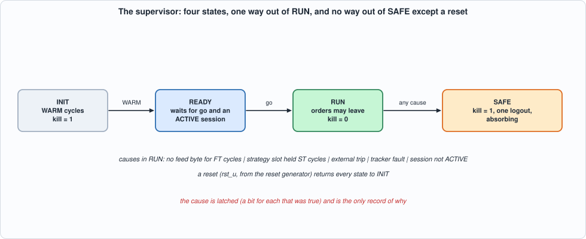
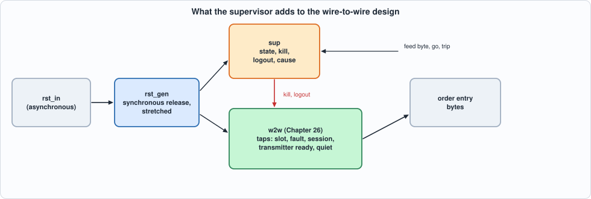

# 27. Resets, Power-Up, Watchdogs and Safe States: A Supervisor That Decides Whether Orders May Leave


--8<-- "docs/assets/art/ch-27.md"


**What you will see:** the design of Chapter 26 does what it is told. This chapter adds the one thing that decides whether it *should*: a **supervisor**, a four-state machine (INIT, READY, RUN, SAFE) around the wire-to-wire design. After a reset it keeps the gate killed while the units warm up and the control plane finishes configuring; in RUN it watches five things (the feed has gone silent, the strategy slot is stuck, the tracker has faulted, the session has left ACTIVE, an external trip) and any of them sends it to **SAFE, which only a reset leaves**: the gate is killed, a logout is sent once, and the cause is latched. In front of it a **reset generator** asserts at once and releases in step with the clock. The chapter is about what such a layer *can* promise (nothing starts after the supervisor has left RUN, but what was already in flight is a measured, bounded exposure) and about what testing it finds: a gate that silently ignores an arm, an interface that overwrites an order, and three mutants that no cycle-accurate simulation can tell from the original.

**What you need to know first:** Chapter 23 (the kill input and what the gate does with it), Chapter 25 (the tracker's fault: fail closed), Chapter 26 (the wire-to-wire design and its cycle budget) and Chapter 13 (timers and liveness).

**What this chapter builds:** `rtl/sup.sv` (`sup`, `rst_gen`, `sup_syn`), `rtl/safe.sv` (the supervised design), taps added to `rtl/w2w.sv`, `model/sup_gold.py`, `model/safe_gold.py`, `tb/sup_tb.sv`, `tb/safe_tb.sv`, `formal/sup_props.sv`, `tools/ch27_sup.py`, `tools/ch27_run.py`, `tools/ch27_formal.py`, `tools/ch27_example_a.py`, `tools/ch27_example_b.py`, `tools/mut_ch27.py`, `tools/make_figs_ch27.py`. The units of Chapters 16 to 25 are unchanged; `w2w` gained five output ports (`tap_*`), and Chapter 26's sweep was re-run and still passes.

!!! warning "A model of a design, not a product"
    **A supervisor is not a safety case.** The rules here (which silence counts as a lost feed, which stall as a stuck pipeline, that a logout is how open orders are cancelled) are this book's assumptions; the logout assumes an exchange that **cancels a session's open orders on disconnect**, which many do and many do not. Nothing here has been connected to a market, and a real deployment's limits, kill paths and regulatory requirements come first.

!!! note "Scope: what this chapter leaves out, on purpose"
    **No power-supply or clock monitoring** (a supervisor in logic cannot see a clock that has stopped). **No second, independent kill path** (a hardware switch, the exchange's own kill): the supervisor is one layer, and the page says what it does not cover. **Metastability is not modelled**: RTL simulation shows cycle behaviour, not the failure of a flip-flop whose input changes at the clock edge. **No register interface**: `go` and `trip` are pins.

## The specification

`model/sup_gold.py` states the supervisor and the reset generator; `model/safe_gold.py` composes the supervisor with Chapter 26's model.

- **INIT** after a reset, for `WARM` cycles: the units clear their RAMs (the book needs 32 cycles). `kill` is high.
- **READY**: waiting for the control plane's `go` *and* an ACTIVE session; `kill` is high.
- **RUN**: orders may leave (`kill` low). Two counters run: the cycles since the last feed byte (`fc`) and the cycles the strategy slot has been held (`sc`). In every RUN cycle five causes are evaluated: `fc >= FT`, `sc >= ST`, the external `trip`, the tracker's `fault`, the session not ACTIVE. If any is true the state is SAFE in the next cycle, and the **cause register latches a bit for every cause true in that cycle**. Note the edge: `fc` is the count *before* this cycle's byte, so a byte in the very cycle the count reaches FT does not save the session.
- **SAFE** is absorbing. `kill` stays high. A **logout request** is offered once, in the first SAFE cycle in which the session is ACTIVE, the transmitter is ready *and nothing is in flight* (the lifecycle idle, no order held, no answer being sent): the transmitter's request port has one place, and a request offered while an order's answer is being sent would overwrite it.
- **The reset generator** asserts the units' reset in the same cycle as the external input (asynchronously) and releases it two clocks after the input goes away, and then holds it for `RSTN` more: a release aligned to the clock and long enough for the slowest unit.


*Figure 27.1: the states.*

**In the supervised design** (`safe`): the units see the stretched reset; the gate's kill input is the control plane's OR the supervisor's; the supervisor's logout takes the transmitter's request port ahead of the control plane's; and the supervisor reads five taps of the wire-to-wire design (the strategy slot, the tracker's fault, the session state, whether the transmitter is ready, whether nothing is in flight).


*Figure 27.2: what the supervisor adds.*

**The properties the chapter claims**, checked by the model on every run: **P1** kill is high in every cycle in which the supervisor is not in RUN, and no order offered in such a cycle is answered OK; **P3** SAFE is absorbing until a reset; **P4** the logout is offered once; and **P2** no order *starts on the wire* more than 37 cycles after the supervisor left RUN (5 for the lifecycle, 1 for the transmitter, up to 31 for a transmitter that is still sending): **an order that was already in flight is not recalled**, and the exposure is measured (Example B).

## The hardware

- **The supervisor is 70 LUTs and 35 flip-flops** (Example A) in a design of about 9,960: two counters, a state register, and a compare per cause.
- **Two counters, no saturation, no clearing on entry.** The first version saturated each count at its limit and cleared both on entering RUN. The mutation run showed that neither can matter: a count that reaches its limit leaves RUN in the next cycle, and nothing counts outside RUN. Both were removed.
- **`kill` is a function of the state alone** (`state != RUN`), which is what the gate samples when an order is offered; there is no register to be late.
- **The logout waits for quiet.** `quiet` is the lifecycle idle, no order held for the transmitter, and no answer being sent: it is a tap of Chapter 26's design, and three mutants show each of its terms is needed.
- **The reset generator** is a two-flip-flop chain (asynchronous assertion, synchronous release) and a counter that is loaded while the chain's output is high and counts down afterwards. The counter has **no reset of its own**: while the chain is high `rst_u` is high, and the counter is loaded at the first clock. (A first version also loaded it asynchronously; the mutation run found that redundant.)

```systemverilog
--8<-- "rtl/sup.sv"
```

```systemverilog
--8<-- "rtl/safe.sv"
```

## The tests

Two sweeps. The supervisor and the reset generator **alone** (`tb/sup_tb.sv`, `tools/ch27_sup.py`): four parameter sets (FT from 5 to 100, ST from 4 to 100, WARM from 3 to 48, RSTN from 1 to 8), five scenarios each. The supervised design (`tb/safe_tb.sv`, `tools/ch27_run.py`): 17 scenarios, every output of Chapter 26's 43 plus the supervisor's state, kill, logout and cause, in every cycle in which the units are not in reset.

```systemverilog
--8<-- "tb/sup_tb.sv"
```

```python
--8<-- "tools/ch27_sup.py"
```

To run: `python3 tools/ch27_sup.py` (a few minutes). Recorded output:

```text
--8<-- "out/ch27_sup_out.txt"
```

```systemverilog
--8<-- "tb/safe_tb.sv"
```

```python
--8<-- "tools/ch27_run.py"
```

To run: `python3 tools/ch27_run.py` (about 15 minutes). Recorded output:

```text
--8<-- "out/ch27_run_out.txt"
```

**Reading the output.**

- **Section 3 of each: the RTL equals the model in all 20 unit runs and all 17 supervised runs, in Icarus and in Verilator.** The unit scenarios are: *each_cause* (every cause alone, then a reset), *boundaries* (a feed byte after FT − 1, FT and FT + 1 silent cycles; a slot held ST − 1, ST and ST + 1 cycles), *random* (random inputs and resets), *goearly* (a `go` while the session is not ACTIVE, which must be ignored) and *pulses* (reset pulses of one and several cycles, one inside the stretch of another).
- **The supervised scenarios** are the Chapter 26 mixes with a supervisor and a control plane that sets `go` at cycle 100, plus *feedloss* (the feed stops at cycle 1500: SAFE at 1801 = FT 300 + the byte's cycle + 2, the logout in the same cycle), *stall* (F = 32 and ST = 60: the slot is held up to 62 cycles by legitimate events, so the supervisor trips on a healthy system, which is the point of the scenario), *trip*, *extkill* (the control plane's own kill around three of the strategy's offers), *holdtrip* (a trip in the cycle before an order is held for a busy transmitter: the logout must wait), *go_early* and *reset* (a reset in the middle of a run: afterwards the units start again and the supervisor waits for a new `go`).
- **Section 2 shows what the wire saw.** Every scenario that leaves RUN does so for the cause the scenario made, **and the cause register says so** (feed, stall, trip, session, fault). The logout is offered once, and not at all when the session is already dead (*refuse*, *close*: nothing to log out of). In the ordinary mixes the supervisor trips at the **end of the feed**, FT cycles after the last byte: a design that is supervised is expected to stop when its input stops.
- **Orders after SAFE:** none in all but two scenarios; in *stall* and *holdtrip* **one order started on the wire after the supervisor had left RUN** (3 cycles after, in *stall*): it had been offered while the supervisor was still in RUN. P2's bound is 37 cycles; the measurement is in Example B.
- **The hand-worked scenarios** (`selftest` of `model/safe_gold.py`) are the model's independent check, written before the model answered. *A*: with FT 300 and `go` at cycle 100, RUN is visible from 101; the feed's last byte is at *t₀*; **SAFE is visible at *t₀* + 302 and the logout is accepted in that very cycle; the session is CLOSED in the next**. *B*: **an arm sent before `go` is ignored** (see below). *C*: a `go` after the order was offered: the order is answered KILL, 3 cycles after the offer.

**What the scenarios showed about the integration** (not about the supervisor):

- **The gate ignores an arm while kill is high** (Chapter 23's rule: "arm sets armed unless kill is high"). A supervisor that holds kill until RUN therefore turns a control plane's early `arm` into a silent no-op: the order is then refused DISARMED although the supervisor is in RUN. The control plane must arm *after* `go`. Scenario *B* is that finding written as a test.
- **A request offered while an order's answer is being sent overwrites the answer** (Chapter 26's contract). The supervisor's logout therefore waits for `quiet`; without it (a mutant) the *holdtrip* scenario catches it.

## The formal proof

`formal/sup_props.sv` drives the supervisor with free inputs (small parameters: FT 4, ST 3, WARM 2) and keeps shadow counters of silent and held-slot cycles. It asserts **S1** SAFE is followed by SAFE unless the reset is applied; **S2** RUN is entered only from READY, by a `go` with the session ACTIVE; **S3** a RUN cycle with a trip, a fault or a dead session is followed by SAFE; **S4** the watchdogs trip **exactly** when the shadow counts reach their limits, neither early nor late; **S5** kill is high in every state but RUN; **S6** the logout is offered only in SAFE with the session ACTIVE, the transmitter ready, nothing in flight, and once; **S7** INIT lasts exactly WARM cycles.

```systemverilog
--8<-- "formal/sup_props.sv"
```

```python
--8<-- "tools/ch27_formal.py"
```

To run: `python3 tools/ch27_formal.py` (under a minute). Recorded output:

```text
--8<-- "out/ch27_formal_out.txt"
```

**Result: proved for 24 cycles from reset (1 s), and 19 of 19 mutants found.** It is a **bounded** proof, at small parameters, and the shadow counters are close to a copy of the supervisor's own (they check the *relation* between the count and the state, not an independent design of the count). The first run found **15 of 19**: the four survivors were mutants that trip a cycle early or late, which the first form of S4 (an *upper* bound only) could not see; S4 was made exact and all four were found.

## Running example A: what it costs and how fast it runs

```python
--8<-- "tools/ch27_example_a.py"
```

To run: `python3 tools/ch27_example_a.py` (a few minutes). Recorded output:

```text
--8<-- "out/ch27_example_a_out.txt"
```

- **Measured:** the supervisor and the reset generator are **71 LUTs and 51 flip-flops on iCE40 at 127 MHz, 45 LUTs at 146 MHz on ECP5** with a watchdog limit of 100 cycles; at **one million cycles** (a 20-bit count) **141 LUTs at 92 MHz on iCE40** and 89 LUTs at 123 MHz on ECP5. The flip-flop counts include the 19 of the pin wrapper.
- **The clock is the INIT counter's compare feeding the state** (`cnt -> state`: 3.5 ns of logic and 4.4 of routing at FT 100 on iCE40), not the watchdogs: the cost of a long watchdog is a few LUTs and a few MHz, and none of it is near the 43 MHz of the design it supervises.
- **In the whole supervised design the supervisor is 70 LUTs of 9,956** (Yosys, before flattening); the rest is Chapter 26's.

## Running example B: how long the exposure is, and how small the limits may be

```python
--8<-- "tools/ch27_example_b.py"
```

To run: `python3 tools/ch27_example_b.py` (under a minute). Recorded output:

```text
--8<-- "out/ch27_example_b_out.txt"
```

- **Detection and exposure (model, equal to the RTL on every scenario):** a feed lost at cycle 1500 is **SAFE at 1801 (the last byte was at 1499: 1499 + FT 300 + 2) with the logout in that cycle**; an external trip at 2000 is SAFE at 2001; the **stall** scenario leaves RUN at 3307 and the logout is accepted at 3314, **7 cycles later**: an order offered just before SAFE was answered and started on the wire at 3311 (**one order starts 3 cycles after the supervisor left RUN**, against a bound of 37), and the logout waits for its four beats to leave and for the transmitter to be free.
- **The margins (section 2): the limits cannot be set by guessing.** The longest silence of the feed in the healthy mixes is **118 cycles** (*slow*: the idle cycles between packets) and the longest hold of the strategy slot **62 cycles** (F = 32; 41 to 46 at F = 12). An FT of 100 would have tripped *slow*; an ST of 60 trips *slowsig* (and does, in the *stall* scenario). The limits must be above what the healthy system does and below what the exchange or the risk department will tolerate, and **those two numbers are the design's inputs**, not outputs.
- **Not measured:** how a real feed behaves (the gaps are the generator's), or what a real exchange does with a logout.

## Testing the tests

Three batteries: the **supervisor and reset generator** (31 mutants; the unit sweep), the **glue** (`safe.sv`: 13 mutants; and the five taps added to `w2w.sv`: 7; the supervised sweep) and the **two models** (7 and 3 mutants; their hand-checked scenarios). The units inside were mutation-tested in their own chapters.

```python
--8<-- "tools/mut_ch27.py"
```

To run: `python3 tools/mut_ch27.py` (about 40 minutes). Recorded output:

```text
--8<-- "out/mut_ch27_out.txt"
```

**Result: 58 of 61 caught, and the three that are not are explained.** The first run caught **54 of 65**; the eleven survivors, and what was done:

| survivor of the first run | why | what was done |
|---|---|---|
| (RTL) RUN does not clear the feed count / the slot count on entry | **equivalent**: nothing counts outside RUN and a reset clears both, so they are 0 on entry | the clearings removed from the RTL and the model |
| (RTL) the feed count / the stall count does not saturate | **equivalent**: a count that reaches its limit leaves RUN in the next cycle, so it never goes beyond | the saturation removed |
| (RTL) the reset stretch is one cycle short (in the asynchronous load) | **equivalent**: the counter is loaded again at every clock while the chain is high | the asynchronous load removed (the counter needs no reset of its own); the mutant for the synchronous load is caught |
| (RTL) a `go` needs no ACTIVE session | **a missing test**: `go` was random and the session almost always ACTIVE | scenario *goearly* |
| (RTL) the control plane's kill is ignored | **a missing test**: no kill was ever offered, and the first attempt placed it where no order was offered | *extkill*: a kill around three of the strategy's offers |
| (RTL) the quiet tap ignores a held order | **a missing test**: a hold never coincided with a trip | *holdtrip* (a trip placed by finding the first hold in the model) |
| (model) the reset stretch is short | **a missing hand-checked case** | the `RstGen(3)` cases in the self-test |
| **(RTL) the reset release is not synchronised; the reset ignores the synchroniser; the units are reset by the raw input** | **equivalent *in simulation***: with a reset pulse that spans a clock edge (the contract), the three differ from the original only in whether the release is aligned to the clock in the presence of metastability, and in how long the stretch is for units that need more than one reset cycle (none of ours does). **No cycle-accurate test can see them**; the synchroniser's job is a property of the flip-flops, not of the logic | documented here; they are the reason this chapter does not claim anything about metastability |

**Slips found on the way.** The first sweep of the *reset* scenario failed after the reset generator was simplified, and it was **the scenario's, not the design's**: the bytes of the packet the reset cut were removed up to the next byte that had a start-of-packet flag, but idle cycles carry random junk in that flag; the next real packet start (valid *and* start-of-packet) is what the scenario now waits for. The first `extkill` scenario put the kill where no order was offered. A `pkill` pattern matched my own shell. And the first supervisor mutation run reported "unmutated design fails its battery" until the scenario was fixed: the script checks that before it counts anything.

## What this chapter established, and what it did not

**Established, with the tests that show it:** a supervisor that equals its model in every cycle (4 parameter sets, 20 scenarios; 17 supervised scenarios; two simulators), with **exact detection** of a silent feed and a stuck slot (proved to depth 24 at small parameters and tested at the boundary cycles); **kill in every state but RUN**, SAFE absorbing, a **logout offered once and only when nothing is in flight**; a bounded and measured **exposure** (one order, 3 cycles after the supervisor left RUN, against a bound of 37); an integration finding (arm before `go` is a silent no-op); and 58 of 61 mutants caught, the other three explained.

**Not established:** anything about **metastability** or a real reset tree; that the **logout cancels open orders** (the book's assumption); recalling an order that is already in flight; a second kill path; limits for a real feed (Example B gives the margins of the generator's); clock or power monitoring; and a register interface for `go` and `trip`.

## Self-check questions

1. List the four states and what `kill` is in each. What leaves SAFE?
2. Name the five causes that send RUN to SAFE, and say what the cause register holds when two are true in the same cycle.
3. A feed byte arrives in the very cycle the silence count reaches FT. Does it save the session? Why?
4. Why does the logout wait for `quiet`? What would be overwritten without it, and which test shows it?
5. What does "an order was already in flight" mean here, and what bounds how long after SAFE one can still start on the wire?
6. Why is an arm sent before `go` silently ignored, and what does the control plane have to do?
7. What does the reset generator do at the assertion and at the release of the external reset? Why is the release synchronised?
8. Why did the first formal run miss four mutants, and what was changed?
9. Name three pieces of code the mutation run showed to be redundant, and say why each was.
10. Why can no simulation tell the three surviving reset mutants from the original, and what does that say about what the chapter can claim?
11. What did the margins study show about choosing FT and ST?
12. What is the logout's assumption about the exchange, and what happens to the design's promise if it is false?

## Exercises

1. **A recall.** The supervisor cannot recall an order that is in flight. Add a cancel for the open orders in the tracker (the tracker knows their tokens) as part of SAFE. What does the transmitter's request port need, what happens to the exposure bound, and what does the tracker do with the exchange's answers?
2. **Recovery.** SAFE is left only by a reset. Design a controlled `clear` that returns to READY after the control plane has acknowledged the cause: what must be true of the gate, the tracker and the session first, and what makes the clear safe against a repeat?
3. **A second watchdog.** Add a watchdog on the exchange's side: no heartbeat from the server for K cycles is already the session's DEAD, but a server that sends heartbeats and never acknowledges an order is not caught. What does the tracker know that makes it detectable (an order in PENDING_NEW for T cycles)?
4. **A register interface.** Put `go`, `trip`, FT, ST and the cause behind a register file. Which writes must be refused in RUN, and what must reading the cause do?
5. **Metastability.** Add a model of the release synchroniser that can be wrong (a flip-flop that resolves late with some probability) and show what the three surviving mutants would do to it.
6. **A mutant that survives.** Add a mutant to `tools/mut_ch27.py` that neither battery catches. Is it equivalent, outside the contract, or is a test missing?
